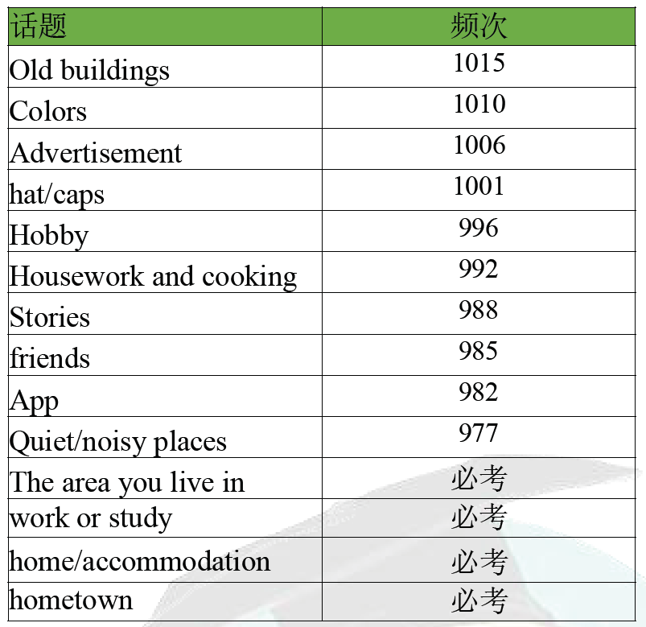
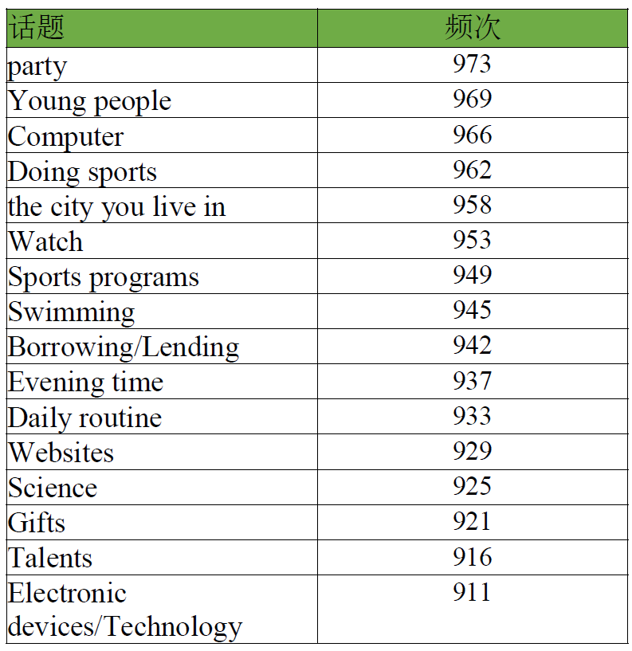

## 一级重点

以下是每个话题的**可能问题、优化后的答案和答题建议**：

------

### **1. The area you live in（广州）**

**Q: Do you like the area you live in?**
 **A:** *Yes, I really enjoy living in Guangzhou. It’s a vibrant and modern city with a fascinating mix of traditional and contemporary culture. The city offers a wide range of entertainment, shopping, and dining options, and the transportation system is incredibly convenient. However, the humidity and occasional heavy traffic can be a bit challenging.*

✅ **答题建议**

- 用**具体细节**支持观点，比如**文化、设施、生活便利性**等。
- 可以提及**优缺点**，但**侧重优点**，让答案更有层次。

------

### **2. Work or Study（本科生，人工智能专业）**

**Q: What do you study?**
 **A:** *I’m an undergraduate student majoring in Artificial Intelligence. My coursework covers a wide range of topics, including machine learning, deep learning, and data science. I find this field fascinating because AI **is shaping the future and has applications in almost every industry**.*

✅ **答题建议**

- 结合**具体课程**或**兴趣点**，让回答更具体。
- **展示热情**，比如用“fascinating, exciting”这类词提升表达。

------

### **3. Home/Accommodation（深圳）**

**Q: Where do you live now?**
 **A:** *I currently live in Shenzhen, a bustling metropolis known for its technological advancements and innovation. My apartment is located in a quiet residential area, which provides a peaceful contrast to the city's fast-paced lifestyle. I enjoy living here because it's safe, well-connected, and full of opportunities.*

✅ **答题建议**

- **描述居住环境**（安静/便利/繁华等）。
- **结合个人体验**（安全、机会多）。

------

### **4. Hometown（湖北仙桃）**

**Q: Where is your hometown?**
 **A:** *My hometown is Xiantao, a small city in Hubei Province. It’s **known for its beautiful rural landscapes** and its **strong agricultural industry**, particularly cotton and rice farming. Life there is much slower compared to big cities, but I appreciate its peaceful atmosphere and friendly community.*

✅ **答题建议**

- 强调家乡的**特色**（农业、自然环境）。
- 可以**对比**大城市和小城市的不同。

------

### **5. Old Buildings（老建筑）**

**Q: Do you like old buildings?**
 **A:** *Yes, I do. Old buildings **have a unique charm and historical significance** that **modern architecture often lacks**. In Guangzhou, for example, there are many well-preserved historical sites like Shamian Island, which reflect the city’s colonial past and cultural heritage.*

✅ **答题建议**

- **提及具体例子**（沙面岛）。
- **用对比**（老建筑 vs. 现代建筑）。

------

### **6. Colors（喜欢蓝色，不喜欢黑色）**

**Q: What is your favorite color?**
 **A:** *My favorite color is blue because it gives me a sense of calm and stability. It also reminds me of the ocean and the sky, which makes me feel relaxed and refreshed.*

**Q: Is there any color you dislike?**
 **A:** *Yes, I’m not a big fan of black. Although it’s often seen as stylish and elegant, I find it too dark and dull for my taste.*

✅ **答题建议**

- 解释**为什么喜欢/不喜欢**，不要只说一句话。
- 可以提及**颜色带来的情感感受**。

------

### **7. Advertisement（广告）**

**Q: Do you like advertisements?**
 **A:** *Not really. While some ads are creative and entertaining, many are repetitive and intrusive. I especially dislike online ads that pop up unexpectedly while I’m watching videos or browsing websites.*

✅ **答题建议**

- 既可以**正面回答**（喜欢创意广告），也可以**表达负面观点**。
- **举例子**，比如视频网站广告。

------

### **8. Hat/Caps（贝雷帽）**

**Q: Do you like wearing hats?**
 **A:** *Yes! I often wear berets because they are soft, comfortable, and loosely fitted. They add a stylish touch to my outfits while keeping me warm on cooler days.*

✅ **答题建议**

- **具体描述**（贝雷帽的舒适度、款式）。
- **结合个人风格**，让答案更个性化。

------

### **9. Hobby（羽毛球、钢琴）**

**Q: What hobbies do you have?**
 **A:** *I enjoy playing badminton and the piano. Badminton helps me stay active and energized, while playing the piano allows me to relax and express my emotions through music.*

✅ **答题建议**

- **解释爱好带来的好处**（健康/放松）。
- **展示多样性**，有运动和艺术类。

------

### **10. Housework and Cooking（没试过但愿意 992）**

**Q: Do you like cooking?**
 **A:** *I haven’t really tried cooking before, but I’d love to learn. It seems like a useful skill, and I admire people who can prepare delicious meals from scratch.*

✅ **答题建议**

- 可以**表达愿意尝试**，增加语言丰富度。

------

### **11. Stories（故事 988）**

**Q: Do you like reading stories?**
 **A:** *Yes, I love reading stories, especially fiction. They allow me to escape reality and explore different worlds and perspectives.*

✅ **答题建议**

- **结合自己喜欢的故事类型**。

------

### **12. Friends（朋友 985）**

**Q: Do you prefer having a few close friends or a big group of friends?**
 **A:** *I prefer having a few close friends. I value deep and meaningful relationships over having many acquaintances.*

✅ **答题建议**

- 解释**为什么选择这个交友方式**。

------

### **13. Apps（手机应用 982）**

**Q: What apps do you often use?**
 **A:** *I frequently use social media and productivity apps. For example, I use WeChat to stay in touch with my friends and Notion to organize my studies.*

✅ **答题建议**

- **举具体例子**（微信、Notion）。

------

### **14. Quiet/Noisy Places（喜欢图书馆、实验室 977）**

**Q: Do you prefer quiet places or noisy places?**
 **A:** *I definitely prefer quiet places like libraries and laboratories. They allow me to concentrate and be more productive without distractions.*

✅ **答题建议**

- **结合学习环境**，更贴合个人经历。

------

## 二级重点

当然可以！我会按照**基本回答 + 解释原因 + 拓展**的结构，让答案更加流畅、自然，且符合高分口语的标准。以下是优化后的答案：

------

### **1. Party（973）**

**Q: Do you like going to parties?**
 *A: It depends on the type of party. If it’s a small gathering with close friends, I really enjoy it because it’s a great way to relax and have fun. However, I’m not a big fan of loud, crowded parties where it’s difficult to have meaningful conversations.*
 *Reason: I prefer a more intimate and comfortable atmosphere where I can truly connect with people.*
 *Extension: That’s why I usually attend birthday parties or small celebrations rather than large club events.*

**Q: What do you usually do at parties?**
 *A: At parties, I usually chat with friends, enjoy the food, and sometimes play games if there are any. If there’s music, I might dance a little, but I mostly prefer talking and having fun with people I know.*
 *Reason: I think parties are a great way to strengthen relationships and take a break from daily stress.*
 *Extension: Sometimes, I also help with organizing the party, such as preparing snacks or setting up decorations, which makes the event more enjoyable.*

------

### **2. Young People（969）**

**Q: What kinds of activities do young people like to do?**
 *A: Young people today enjoy a mix of indoor and outdoor activities. Many like playing sports, going to the gym, or hiking, while others prefer watching movies, playing video games, or spending time on social media.*
 *Reason: It really depends on personal interests, but technology has played a major role in shaping modern entertainment.*
 *Extension: For example, e-sports have become incredibly popular, with many young people watching live gaming competitions online.*

**Q: Do you think young people today are different from those in the past?**
 *A: Yes, definitely. Young people today rely more on technology for communication and entertainment, whereas in the past, they spent more time outdoors and engaged in more face-to-face interactions.*
 *Reason: The development of smartphones and the internet has changed the way people socialize and access information.*
 *Extension: However, I think the core interests of young people, like music, sports, and friendship, have remained the same over the years.*

------

### **3. Computer（966）**

**Q: How often do you use a computer?**
 *A: I use a computer every day because it’s essential for my studies and hobbies. I mainly use it for programming, research, and sometimes entertainment like watching videos or playing games.*
 *Reason: As an AI major, I rely on my laptop for coding and running experiments, which makes it an indispensable tool for me.*
 *Extension: Even outside of studying, I find computers useful for online shopping, reading news, and staying connected with friends through social media.*

**Q: What do you usually do on a computer?**
 *A: Most of the time, I use my computer for studying and coding. Besides that, I also use it to browse the internet, watch movies, and sometimes edit videos.*
 *Reason: Since most academic resources are online, my laptop helps me access papers, research materials, and programming tools efficiently.*
 *Extension: In the future, I’d like to explore more creative uses of my computer, like learning graphic design or music production.*

------

### **4. Doing Sports（962）**

**Q: What sports do you like to play?**
 *A: I really enjoy playing badminton because it’s a fun and fast-paced sport. It helps me stay active and is a great way to socialize with friends.*
 *Reason: Unlike some other sports, badminton doesn’t require a large space, so it’s easy to play in indoor courts or parks.*
 *Extension: I usually play on weekends, and I sometimes watch professional badminton matches to learn new techniques.*

**Q: Do you think doing sports is important?**
 *A: Yes, absolutely. Sports help improve physical health, reduce stress, and even enhance teamwork skills.*
 *Reason: Regular exercise keeps me energetic and focused, which is especially important when I have a busy study schedule.*
 *Extension: I believe everyone should engage in some form of physical activity, even if it’s just a short walk or stretching exercises at home.*

------

### **5. The City You Live In（958，广州）**

**Q: What do you like about the city you live in?**
 *A: I love Guangzhou’s mix of modern and traditional culture. It has a great public transportation system, delicious food, and plenty of interesting places to visit.*
 *Reason: The city is very convenient to live in because everything is well-developed, from shopping malls to entertainment centers.*
 *Extension: One of my favorite things about Guangzhou is its food culture—Cantonese dim sum is a must-try!*

**Q: Is your city suitable for young people?**
 *A: Yes, definitely. Guangzhou offers many job opportunities, excellent universities, and a vibrant social scene, making it an ideal place for young people.*
 *Reason: There are plenty of cafes, parks, and cultural spots where young people can hang out or study.*
 *Extension: Additionally, the city has many startup incubators, which are great for young entrepreneurs looking to start their own businesses.*

------

### **6. Watch（953）**

**Q: Do you wear a watch?**
 *A: No, I don’t wear a watch because I usually check the time on my phone. However, I do think watches can be stylish accessories.*
 *Reason: Nowadays, smartphones have replaced traditional watches in terms of functionality.*
 *Extension: That being said, I do admire people who collect watches because each watch can have a unique design and history.*

**Q: Do people nowadays wear watches as much as in the past?**
 *A: Not really. Since smartphones can display the time, fewer people wear watches for practical purposes. But some still wear them as a fashion statement or for professional reasons.*
 *Reason: Luxury watches, for example, are still popular among business professionals as a symbol of status.*
 *Extension: Additionally, smartwatches have gained popularity because they offer features like fitness tracking and notifications.*

------

### **Borrowing/Lending**

**Q1: Have you ever borrowed something from others?**
 Yes, I have. I remember borrowing a novel from my friend because I was really interested in reading it but didn’t want to buy a copy. I returned it as soon as I finished, as I believe it’s important to take good care of borrowed items. Borrowing can be convenient, but I try not to rely on it too much because I prefer to have my own things.

**Q2: Do you usually lend things to others?**
 It depends on what they need. I don’t mind lending small things like books or stationery, but I’m more cautious with expensive items, such as electronic devices. If I trust the person and know they will take good care of my belongings, I don’t mind helping out. However, if it's something valuable, I usually hesitate because I don’t want to deal with any damage or loss.

------

### **Evening Time**

**Q1: What do you usually do in the evening?**
 In the evening, I like to relax and unwind. After finishing my studies, I usually exercise, like jogging or stretching, to stay active. Before going to bed, I either play games or read a book, depending on my mood. Playing games helps me de-stress, while reading allows me to learn something new. I think having a fixed evening routine is beneficial because it helps maintain a good balance between work and rest.

**Q2: Do you prefer to spend your evenings alone or with others?**
 It depends. On weekdays, I prefer some quiet time alone to read, play games, or just reflect on the day. But on weekends, I enjoy spending time with friends, whether it’s going out for dinner, chatting online, or watching a movie together. I think both are important—having personal time to relax and also socializing to strengthen relationships.

------

### **Daily Routine**

**Q1: Do you usually follow the same routine every day?**
 Yes, I try to follow a consistent routine because it helps me stay organized and productive. During the day, I focus on studying or working, and in the evening, I exercise and relax before bed. Of course, sometimes unexpected things come up, and I have to adjust my schedule, but I believe having a general structure to follow makes my life more efficient.

**Q2: Is your daily routine different on weekends?**
 Yes, definitely. On weekdays, I focus more on studying or work-related tasks, but on weekends, I give myself more time to relax. I might go out with friends, watch movies, or simply sleep in. Also, I sometimes use weekends to catch up on things I didn’t have time for during the week, such as hobbies or organizing my room.

------

### **Websites**

**Q1: What websites do you visit frequently?**
 I often visit educational websites like Google Scholar and Coursera for studying. For entertainment, I browse social media platforms like Instagram or watch videos on YouTube. I also check news websites regularly to stay updated on current events. I think the internet is a great source of knowledge, but it’s also important to use it wisely and not get too distracted.

**Q2: Do you think people spend too much time on websites nowadays?**
 Yes, I think so. Many people, including myself, sometimes spend hours on social media or streaming sites without realizing it. While websites are useful, excessive screen time can be unhealthy. I try to set limits for myself by taking breaks and focusing on offline activities, like reading or exercising, to maintain a healthy balance.

------

### **Science**

**Q1: Are you interested in science?**
 Yes, I find science fascinating because it helps us understand how the world works. I’m especially interested in space exploration and medical research, as they have the potential to change the future. For example, recent advancements in AI-driven healthcare have improved disease detection, which is truly amazing. I believe scientific discoveries not only enhance our quality of life but also inspire future generations to push the boundaries of knowledge.

**Q2: Did you enjoy science classes in school?**
 Yes, I did. I liked conducting experiments and learning about different scientific concepts. However, some topics, like chemistry, were quite challenging for me. Despite that, I think science education is important because it helps us develop critical thinking skills and a deeper understanding of the world around us.

------

### **Gifts**

**Q1: Do you like giving gifts to others?**
 Yes, I enjoy giving gifts, especially when I find something that perfectly matches the person’s interests. I think a thoughtful gift can strengthen relationships and bring happiness to both the giver and the receiver. I usually take time to choose something meaningful rather than just buying something expensive, because I believe the thought behind the gift matters more than its price.

**Q2: What kind of gifts do you like to receive?**
 I prefer gifts that are practical or meaningful. For example, I love receiving books related to my interests or personalized items that show the giver has put some thought into it. Handmade gifts are also special because they carry a personal touch. In the end, it’s not about the value of the gift but the intention behind it that makes it meaningful.

------

### **Talents**

**Q1: Do you think everyone has a talent?**
 Yes, I believe everyone has their own strengths. Some people are naturally good at music or sports, while others have a talent for problem-solving or creativity. Even if someone doesn’t have an obvious talent, I think with practice and effort, anyone can develop skills that make them stand out in their own way.

**Q2: What talent would you like to have?**
 I wish I could play a musical instrument like the piano or guitar. I think music is a great way to express emotions, and it would be amazing to perform for friends and family. Learning an instrument also requires patience and dedication, which I think are valuable qualities to develop.

------

### **Electronic Devices/Technology**

**Q1: How often do you use electronic devices?**
 I use them every day, especially my phone and laptop. I rely on them for studying, entertainment, and communication. However, I try to take breaks to avoid digital fatigue. Sometimes, I also set screen time limits for myself so that I don’t get too distracted and can focus on other activities, like reading or exercising.

**Q2: Do you think technology has improved our lives?**
 Yes, definitely. Technology has made communication and access to information much easier. For example, we can now connect with people from all over the world instantly and learn new things online. However, it also has drawbacks, such as reducing face-to-face interactions and increasing screen time. I think the key is to use technology wisely and not let it control our lives.

------

