## 小作文题型

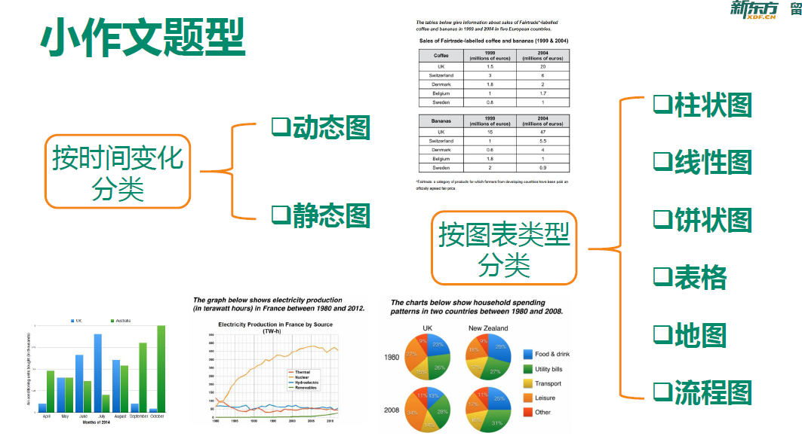

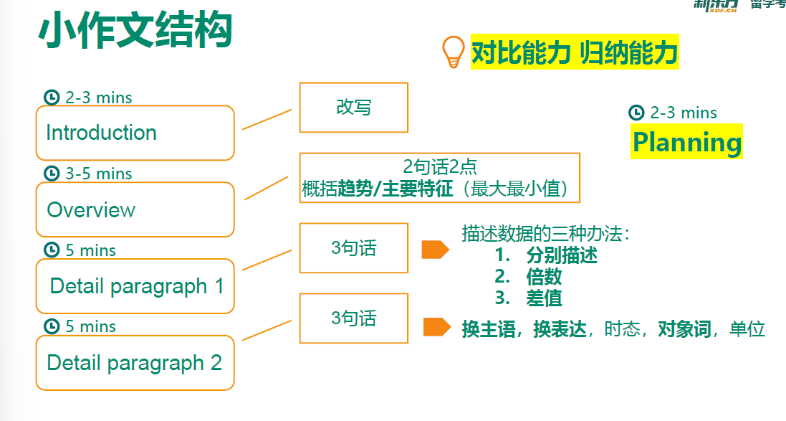

### example

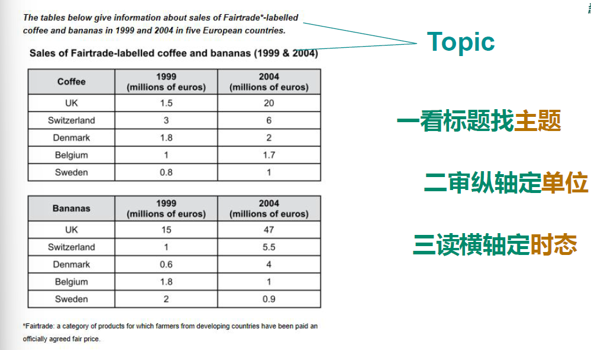

首先看到主题是关于the sales of Fairtrade-labelled coffee and bananas，之后看表格的纵轴来确定讨论对象为UK, Switzerland, Denmark, Belgium and Sweden.

### Introduction

原句：The tables below give information about sales of Fairtrade-labelled coffee and bananas in 1999 and 2004 in five European countries.

改写：The tables compare sales of two categories of products, namely: coffee and bananas, which had Fairtrade labels attached to them in five European countries in two different years, 1999 and 2004.

1. 首先图形的种类具体化，below需要删除
2. “展示”动词适当替换：可以替换为illustrate, compare, present, show
3. 图表内容同义替换the number/amount/percentage of/how...change

### introduction方法总结

#### 动态图专用开头1

**The chart shows how the number/amount/proportion/level of sb./sth(对象词) changed(注意时态)**

e.g. The chart shows how the amount of four different kinds of meat consumed in a European country changed during the period of 1979 to 2004.

e.g. The bar chart illustrates how the proportion of households that lived in owned and rented accommodation in England and Wales changed from 1918 to 2021.

#### 动态图专用开头2

**The chart compares(注意第三人称单数) sth. (对象词) + 地点 + 时间**

The pie charts compare the proportions of people falling into three distinct age groups in Yemen and Italy in two different years.

The pie charts compare five categories of household expenditure in the UK and New Zealand in the years 1980 and 2008.

### 开头段练习拓展

改写：

1. 同义词
2. 换词性
3. 换说法
4. 相关词汇

e.g.1 The tables compare the sales figures of two goods labelled as Fairtrade products in five countries in Euro over a period of five years.

👇👇👇👇👇

The tables show the amount of money spent on Fairtrade coffee and bananas in two separate years in the UK, Switzerland, Denmark, Belgium and Sweden.

首先把compare换成show，sales换成amount of money spent，five contries in Euro替换成具体的国家（凑字数），最后over a period of five years换成in two separate years。

e.g.2 The graph below shows electricity production (in terawatt hours) in France between 1980 and 2012.

👇👇👇👇👇

The line graph compares the amount of electricity produced in France using four different sources of power over a period of 32 years.

or

The line graph gives a breakdown of power generated from different energy sources over a 32-year period.

## Planning 提纲

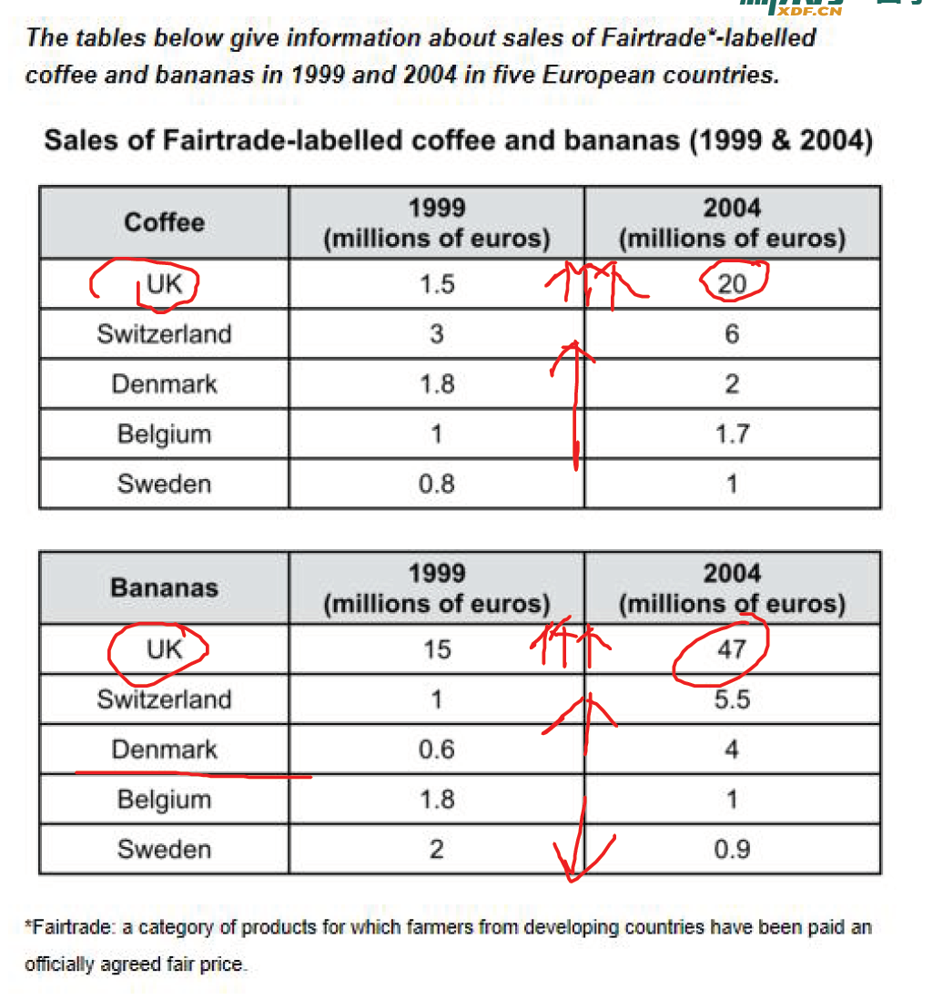

提纲大致分为两段到三段，有Overview, Paragraph 1 and Paragraph 2 三个部分，通常来说Overview会和改写句一起放到第一段。后面的Paragraph 1 and Paragraph 2 两个部分看个人的分类情况，有不同的分类方法：按照表格（商品类别），按照类别（国家等），按照时间（纵轴）

e.g. 观察上述图表，我们可以看到：

**Overview:**

coffee↑, banana↑

UK++ for both

**Detail Para 1: coffee**

Switzer double from 3 to 6

UK ↑↑ 20 in 2004

others 0.2-0.7

**Detail Para 2: Bananas**

UK ++ 15 in 1999, 47 in 2004

Switzerland and Denmark ↑ 5times

rest ↓ about 50 percent

e.g.2 bar chart

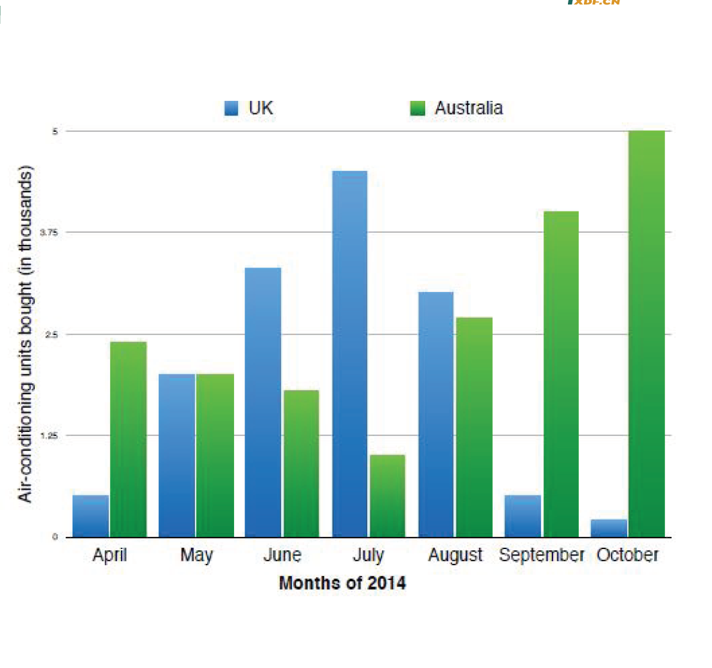

planning 提纲练习

**Overview:**

UK up then down, AU down then up

UK 7++, AU 10++

Detail para 1(from April to July):

UK ↑ AU↓, UK to 5

April: AU 5 times UK

July: UK the highest, 4 times AU

Detail para 2(from July to October):

UK↓↓ AU stable ↑

Augest: small difference

October: UK the lowest AU the highest

## Planning 概述

**Overview:**

coffee↑, banana↑

UK++ for both

It is clear that sales of Fairtrade coffee rose in all five European countries from 1999 to 2004, but sales of Fairtrade bananas only went up in three out of five countries. Overall, the UK saw by far the highest levels of spending on the two products.

**Paragraph 1(按照种类分类):**

The sales figure for **coffee** in Switzerland was the highest at 3 million euros in 1999, and its sales doubled in 2004. The sales in the UK, on the other hand, was just half of that in Switzerland in 1999, but there was a remarkable increase in the amount of coffee sold in the UK over the period, with 20 million coffee sales in 2004. Other countries also experienced slight rises, ranging from 0.2 to 0.7 million, in coffee sales.

**Paragraph 2:**

By contrast, much more **bananas** were sold in the UK than any other countries in
each year, with sales at 15 million in 1999 and at 47 million in 2004 respectively. The
Fairtrade-labelled bananas had also become increasingly popular in Switzerland and Belgium, and the revenue both saw an over fivefold increase. Finally, the money spent on bananas fell by 0.8 million euros in Belgium and 1.1 in Sweden respectively.

或者按照国家分类：
Paragraph 1(UK & Switzerland):

In 1999, Switzerland had the highest sales of Fairtrade coffee, at 3 million euros, while revenue from Fairtrade bananas was the highest in the UK, at 15 million euros. By 2004, however, sales of Fairtrade coffee in the UK had risen to 20 million euros, and this was over three times higher than Switzerland’s sales figure for coffee in that year. The year 2004 also saw dramatic increases in the money spent on Fairtrade bananas in the UK and Switzerland, with revenues rising by 32 and 4.5 million euros respectively.

Paragraph 2(Other countries):

Sales of the two Fairtrade products were far lower in Denmark, Belgium and Sweden.
Small increases in sales of Fairtrade coffee can be seen, but revenue remained at 2 million euros or below in all three countries in both years.
Finally, it is noticeable that the money spent on Fairtrade bananas actually fell in Belgium and Sweden.

# 句型和替换

## 替换

数量的替换：

可数名词：

the number of = the figure for

不可数名词：

the amount of... = the quantity of... = the figure for...

百分比：

the proportion of + 对象 = the percentage of + 对象 = the figure for + 对象/国家/年份

时间的替换：

2000年到2010年之间

1. over the 10-year period
2. over a period of 10 years
3. from 2000 to 2010
4. between 2000 and 2010
5. during a decade

### Overview

总体来说：in general = overall = generally

由图可知：It is clear that... = It is noticeable that... = It can be seen from the chart that... = According to the chart...

内容：

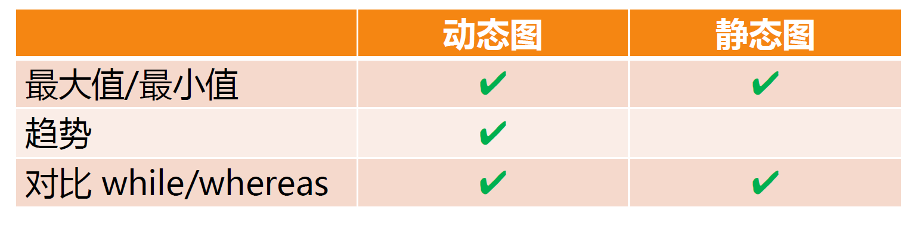

## 词汇

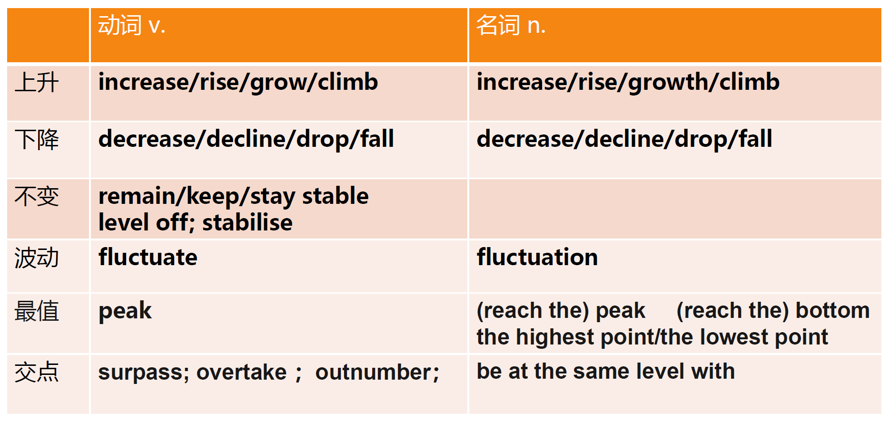

交点需要多留意

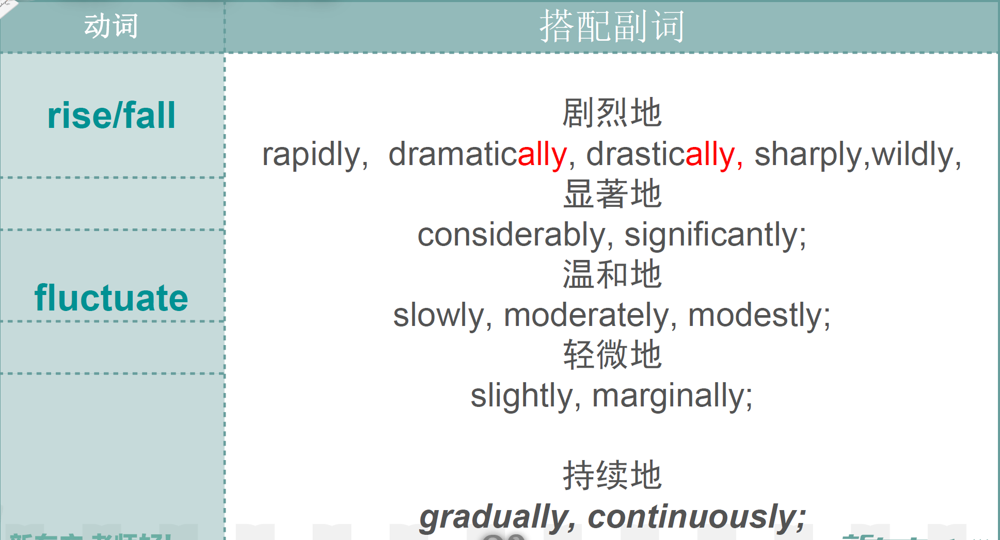

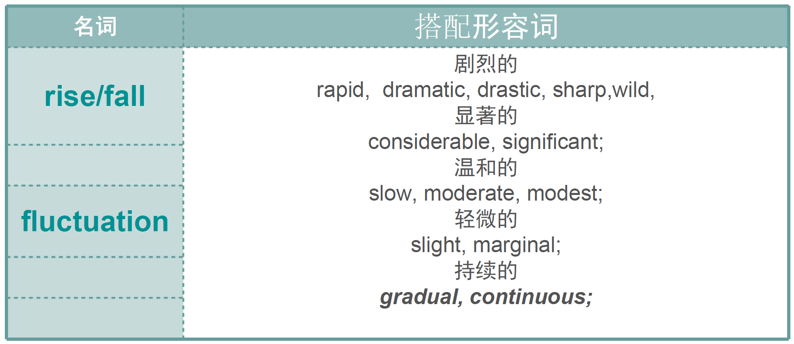

## ==变化趋势句型==

1. 对象词 + saw/witnessed/experienced + a/an increasing/upward or decreasing/downward trend + 时间

e.g. 

Samsung and Apple saw an increasing trend in sales over the period.

2. 时间+ saw/witnessed/experienced + 变化趋势(adj. + n.) + 对象词

The whole period saw a remarkable increase in the number of handsets sold by Samsung and Apple.

3. The number/percentage/proportion/amount/figure of/for 对象词 + adv. + v. +数据 + 时间

The sales figure for coffee in the UK had dramatically risen to 20 million euros by 2004.

4. There be a + adj. + n. + 对象词 + 数据 + 时间

There was a sharp increase in the amount of coffee sold in the UK over the period, with 20 million coffee sales in 2004.

## 四大趋势变化基本句型

1. 主谓句
2. There be 句
3. 呈现句
4. 见证句

1. 主谓句：对象/数据 + 升降动词 + 幅度副词

**The passenger number rises dramatically/marginally from... to...**

number 可换 Figure/ amount(+不可数名词)

The population of India rose substantially from 800 million to 1 billion.

2. There be + a/an + 幅度形容词 + 升降名词

**There is a dramatic increase in the 数据/对象 from ... to ...(is 可以替换 appears/follows)**

e.g. There appears a sharp rise in the number from 100 to 900 during the first/initial 2 hours.

3. 对象/数据 + 呈现(show/illustrate/experience) + a 升降 ing trend

**The number shows/illustrates/experiences a + (幅度形容词) + rising trend from... to ...**

e.g. The mobile calls showed a dramatic rising trend from 2 billion to 6 billion minutes.

4. 时间段 + 见证(see/witness) + 升降名词

**The xxx period/The initial/subsequent/following three years saw/witnessed a sharp decrease in the figure for xxx from ... to ...**

e.g. The subsequent 5 years saw a sharp increase in the figure for western countries from 7% to 90%.

### 语法结构

Apple sold more handsets than LG and ZTE in 2011, and its figure reached 90 million units.

Apple sold more handsets than LG and ZTE in 2011, with sales of 90 million units.

..., with 90 million sold.(过去分词done)

..., with the figure reaching 90 million.(现在分词doing)

**with结构练习：**

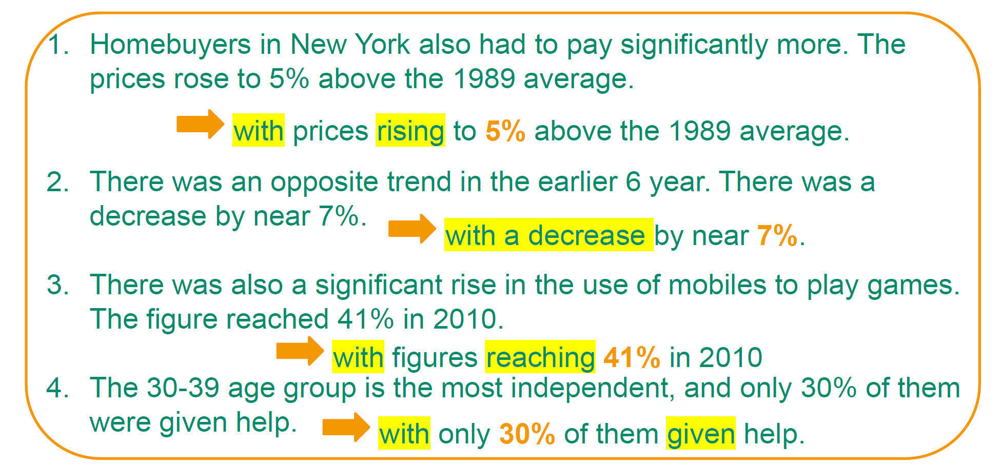

Homebuyers in New York also had to pay significantly more with prices rising to 5% above the 1989 average.

要注意with结构一般用在There be 结构中

**分词结构练习：**

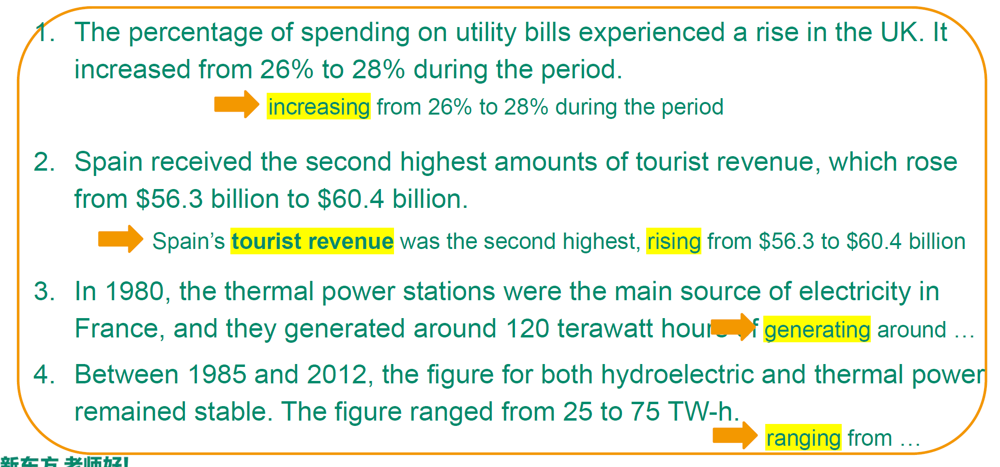

The **percentage of spending on utility bills** experienced a rise in the UK, increased from 26% to 28% during the period.

要注意是主谓形式，后面的趋势变化就是前面的主语的动词。

**before doing结构**

如果两个句子讲同一个对象在一定时期内的变化（如一句讲上升，另一句讲下降），可以用before doing连接这两句话。

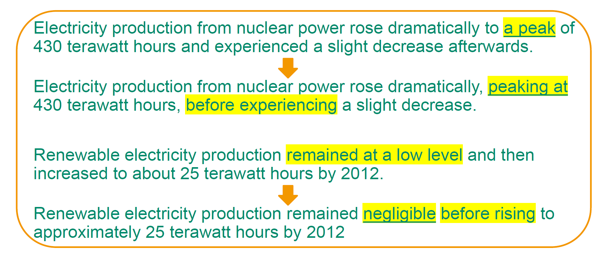

主语经历..., before doing...

## 动态图练习

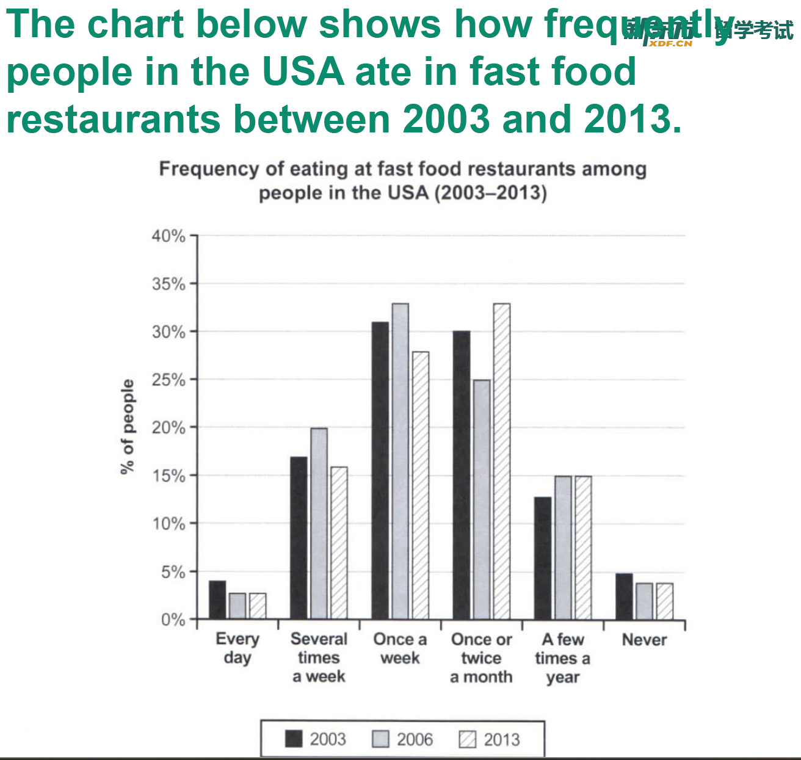

### Introduction

首先变换句型：

1. frequently -> often
2. People in USA -> the US citizens
3. Between ... and ... -> from ... to ... / in the years 2003, 2006 and 2013

于是原句：

The chart below shows how frequently people in the USA ate in fast food restuarants between 2003 and 2013.

:arrow_down:

The bar chart illustrates  changes in the frequency of US citizens ate in fast food restuarants in the years 2003, 2006 and 2013.

### 主体段结构：

第一段：写主题下降趋势的部分

其中每三个组合就能表示一个趋势，可以发现有2个处于上升，其他4个处于下降

具体来说：

1. Every day 与 never 趋势一致且数据相似（先下降后平稳）
2. several times 与 once a week的趋势一致（先上升到顶点后下降）
3. once or twice a month 先下降后上升
4. a few times a year 先上升后平稳

1，2放在第一段，3，4放在第二段

#### 主体段1：

From 2003 to 2006, the percentage of people who had never eaten or eaten every day at these restuarants had fallen by 1% from the original 5% and 4% respectively. Since 2006, no changes had occurred in these segments of the chart. During the same period, the figures for those eating fast food once and several times on a weekly basis also decreased to about 27% and 15%, despite their peaking at 33% and 20% in 2006.

#### 主体段2：

There was an opposite trend for the population eating at such facilities monthly or a few times a year. Although the proportion of the former had seen a dramatic decrese in 2006, it increased to 33% and constituted the largest part of the population in 2013. The latter experienced a marginal increment to 15% in 2006 and remained the same until 2013. As a whole, the majority of people ate out at fast-food restuarants once a week or once/twice a month, and these restuarants were the most popular in 2006 and least popular in 2013.

## 静态图

开头段也是对原题进行改写，与动态图的方法一致

### Example 1

### overview

Overall, the most developed areas among the six mainly use water for industry while the less developed ones use water mostly in the agricultural sector. Among all areas, Europe has the largest proportion of water for industrial purposes, while the figure for agricultural use is the highest in Central Asia.

### paragraphing

按用途分：

1. Industrial use
2. Agricultural use
3. Domestic use

按地区分段：

1. NA + EU
2. Others

Key features

1. industry > agriculture > domestic
2. Industrial +++ in EU, Agriculture +++ in CA, Domestic +++ in SA

Details

1. Industry 53%(half), agriculture 32%, domestic 15%

Comparison

1. industry biggest, agriculture second, domestics smallest
2. EU agricultural double domestic

区域间比较：

1. Industry: EU slightly > NA
2. agriculture: NA slightly >EU
3. domestic: EU similar NA

### 思路1

#### 主体段1

People in North America and Europe use water with slight differences. More than half (53%) of the consumption in Europe is for industrial production, slightly higher than 48% in North America. Conversely, 7% more water is needed in the former than the latter for agricultural sue. In both continents, less than 20% is for domestic consumption.

#### 主体段2

In these two regions, industry is the biggest consumer of water. In Europe, slightly over a half is used by this sector, while a third is for agricultrual purposes. Household use the smallest amount, 15%. In North America, water use for agriculture constitutes 39% of the total, moderately higher than that in Europe. In addition, almost a half is consumed by industry, while domestic use is made up of merely 13%.

### 思路2

Key features

Agriculture > industry and domestic

Agriculture +++ in CA

domestic +++ in SA

Details

Agriculture: 80% + (except SA 71%)

Industry: much lower < 15%

Domestic: <20%, SA 19%

#### 主体段1

There are different patterns in other areas. The majority fof water is consumed for agriculture, with proportion reaching 88% in Central Asia and ranging between 70% and 85% in other three places. In contrast, the figures for ther other two purposes are considerably lower. As for domestic use, except 19% in South America, the data are below 10%, and for industrial productions, the percentages are no larger than 15%.

#### 主体段2

The other four regions saw great use of water in the agricultural sector. Africa and central Asia use the largest amounts in agriculture, at 84% and 86% respectively, while industry and households share the rest nearly equally. Around four fifths of all water consumed in Southeast Asia is for agricultural use. While 12% goes to industry, the remaining 7% is for domestic use. In South America, households are also the lowest consumer of water (10%), but industry uses almost twice as much. The remainder (71%) is all for agriculture.

### Example 2

It is clear that China and USA were the biggest producers and users of the electricity by far. Except for Germany, all countries in question produced more electricity than they used, though the diffences were generally not large.

### paragraphing

Key features

1. CN+++, US+++, Russia = 1k

Details

1. CN 5400, US 4000, Russia = 1/5 CN

Key features

1. 450 < other < 1000, Germany C > P

Details

1. 450 < other < 1000, Germany C - P = 60, KR < 500 least

#### 主体段1

China generated and consumed just under 5400 billion kWh electricity, and both figures topped the list in its own cate gory. America was the second largest electricity supplier, producing 4099 billion kWh in 2014, which surpassed its consumption amounts by around 300 billion kWh. The third ranking country in production and consumption of electricity was Russia, with the figures merely one fifth of those of China.

#### 主体段2

For the rest countries, the amounts of electricity generation and consumption all fell within the spread of between 450 and 950 billion kWh. While Germany consumed about 60 billion kWh more than it produced, the amounts of electricity Korea produced and used were the lowest at no more than 500 billion kWh.

## 句型与表达

比较级： 对象词 + v. or be动词 + adv + adj(比较级) + n. + than + 比较对象（数据 + $时间_{动态图}$）

比较对象（数据 + $时间_{动态图}$）

Germany C - P = 60 billion kWh

**Germany consumed about 60 billion kWh more than it produced.**

Agriculture 39% in NA, higher than Europe

**In North America, water use for agriculture accounts for 39% of the total, moderately higher than that in Europe.**

最高级：对象词 + v. + the highest/ most/ largest/ lowest/ smallest

Industry +++ in NA & EU

**In developed regions, industry is the biggest consumer of water.**

Agriculture +++ in Africa(84%) and Central Asia(86%)

Africa and central Asia use the largest amounts in agriculture, at 84% and 86% respectively.

常用连接词：

while/ whereas 前后跟句子，如果描述的是同一个主语可以改成短语形式

compared with/ to, 跟短语

by contrast/ in comparison 不能连接两个句子

倍数句型：

对象词+v. or be. + 倍数词 as much/many/high/big as 比较对象

倍数词：twice/ three times/ five times

In SA industry (19%) twice domestic (10%)

**In SA, industry (19%) uses almost twice water as much as households (10%)**

$\downarrow$

**In South America, households are alse the lowest consumer of water (10%), but industry uses almost twice as much.**

对象词+倍数词(v.)/be + 倍数词(adj./ n.) + 比较对象

倍数词：double/triple/quadruple/two thirds/ one tenth

Russia 1/5 CN

The production and consumption of electricity in Russia was one fifth of that of China.

$\downarrow$

The third ranking country in production and consumption of electricity was Russia, with the figures merely one fifth of those of China.

定语从句

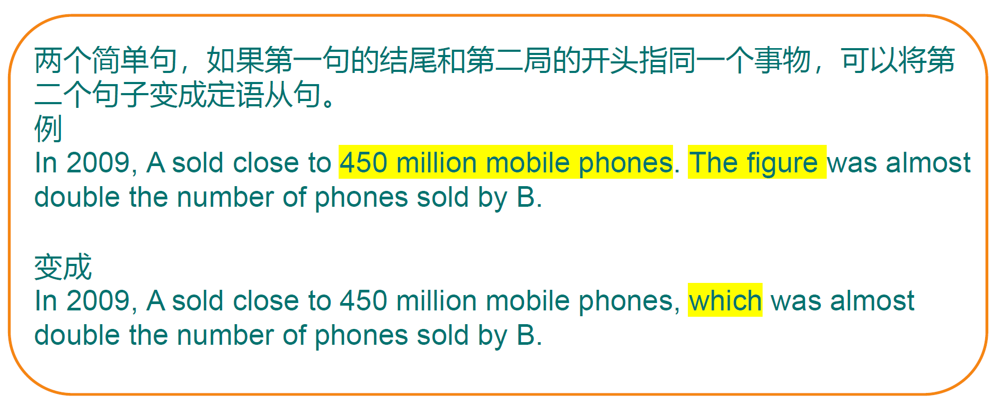

e.g.

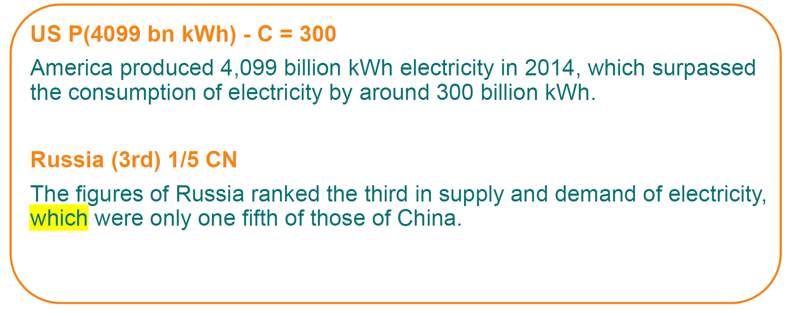

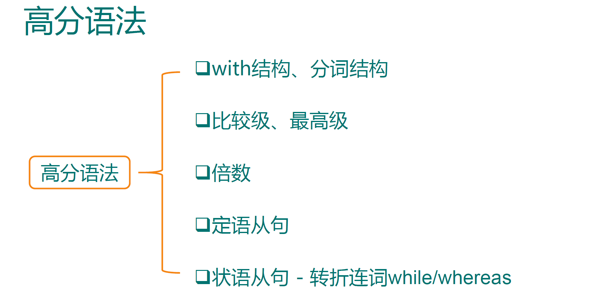

## 全文练习(动态＋静态)

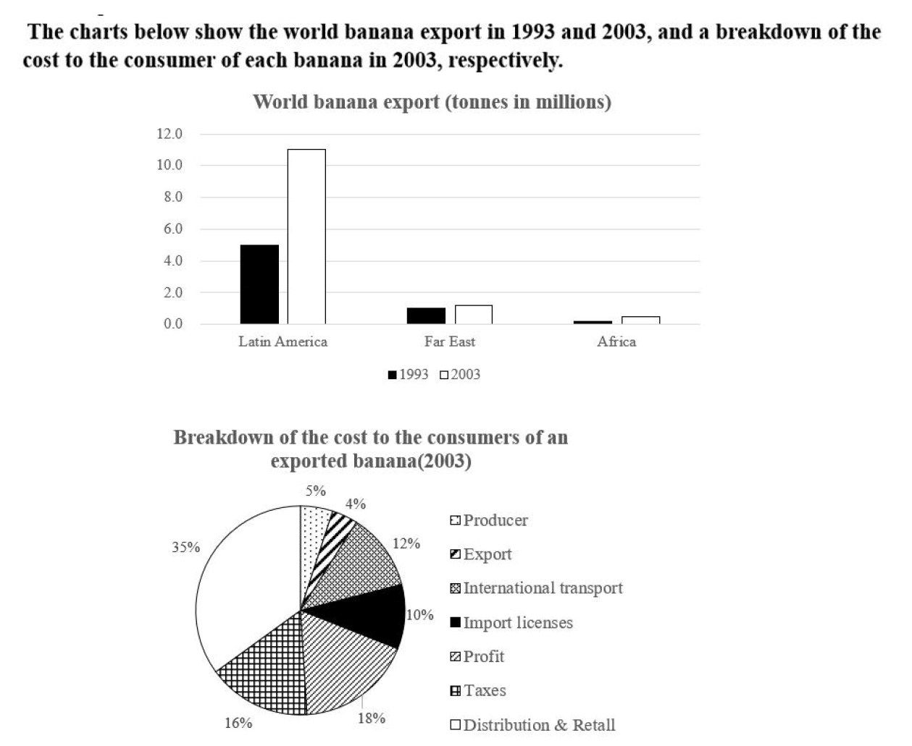

### Planning

overview:

1. banana整体都有上升趋势

2. latin的banana上升幅度很大，同时本身出口就很多
3. 图二中Distribution & Retail占比很多

detail paragraph1：

1. 1993 LA有5million，是别的5倍
2. 2003 LA有11million，相比自己翻了1倍
3. FE到达1.2，Africa到达0.8

detail paragraph2：

1. D&R 占比非常多，达到了三分之一，producers占比很少，只有5%
2. exporters 占比最少，只有4%
3. profit第二多占比，18%；taxes第三多，为16%
4. shipping & import licenses

### Overview

Overall, this period saw a rise in the number of bananas from all exporting areas with Latin American exporters shipping most bananas in both years. Although the largest part of the banana export cost was from distribution and retail, the cost of each part was unevenly distributed.

### Detail para 1

In 1993, the largest banana exports came from Latin America at about 5 million tonnes, which was almost **five times more** than the rest of world combined. By 2003, Latin American exports had noticeably increased to 11 million tonnes, **twice its figure** in 1993. **By contrast**, exporters in Far East were responsible for 1.2 million tonnes, followed by African shippers with less than 1 million tonnes.

### Detail para 2

The cost breakdown of bananas reveals that over one third of the cost went to distribution centres and retailers, whereas producers received merely 5%, and exporters 4%, of the value of the crop. Profit and taxes accounted for the second and third largest proportion of the cost each banana sold at 18% and 16% respectively. Finally, figures for shipping and import licensing **were roughly the same**.
