# Map&Flowchart

## Map

### 描述一个区域的前后变化

方法1：提纲包括Introduction（改写原题），Body1（大的变化），Body2（小的变化），Summary

方法2：提纲包括Intro，Body1（第一张图），Body2（第二张图），Summary

#### Introduction

原句：The plans below show a public park when it first opened in 1920 and the same park today.

↓↓↓

The two maps compare the ==**geographies/layouts**== of ... between... and ...

或

The two maps illustrate the changes to **someplace** according to ...

example: The maps compare the layouts of Grange park between its initial design in 1920 and the present structure.

### 细节

#### 方位名词：north(northern part/area); top/upper

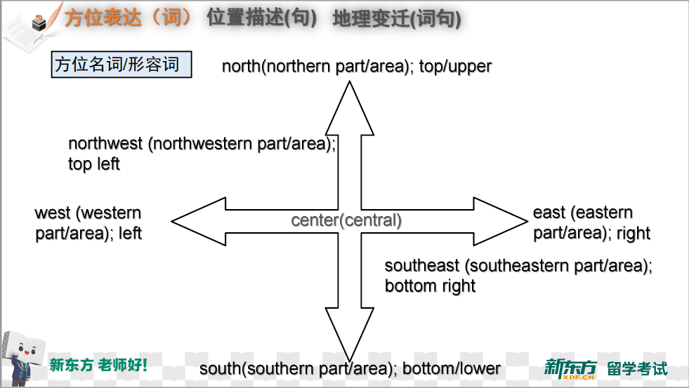

1. in (表示在一个区域的内部)

in the east/center/north-east corner of B

2. at (表示在一个小的点上)

at the east end of ...

3. to/on the ... side of(表示在...外部)

A is to the east of B

A is on the east/eastern/right side of B

4. be next to/be close to/near (表示在外部旁边)

5. sth is opposite sth/ be on the opposite side of the road(对面)

6. along sth(one side/both sides of the road)沿着

sth will be built alongside the road.

#### 位置描述

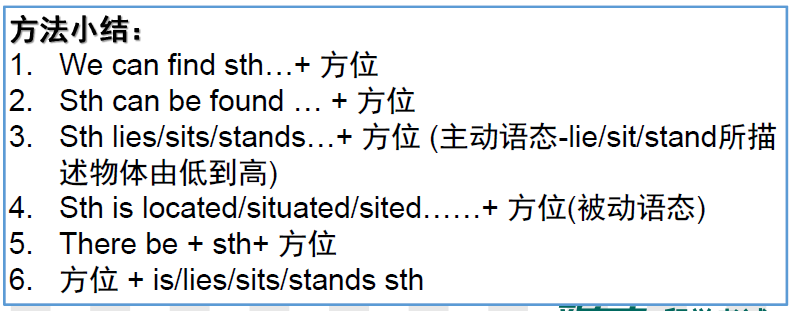

#### 变化词汇

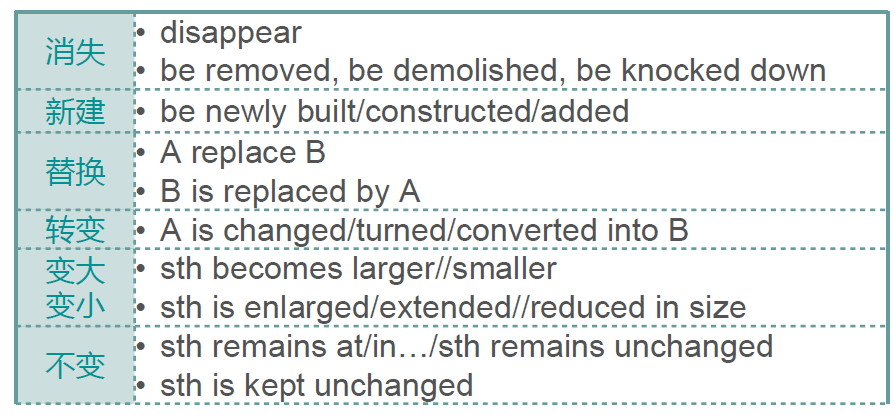

#### 变化句型

单个变化：

A + disappears/becomes smaller/larger(主动)

A + be removed/constructed/extended(被动)

A变B: A + be replace by B/changed/turned into B...(被动)

并列句/从句

..., and...

B + be constructed in the ..., where A + be found/located

## Example

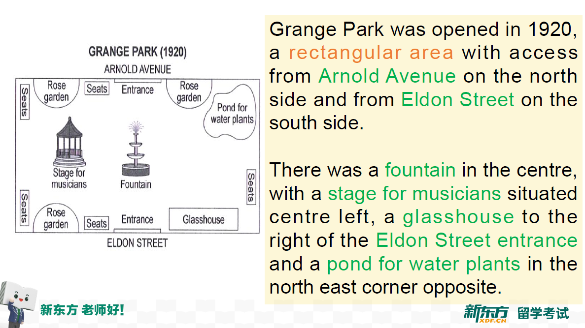

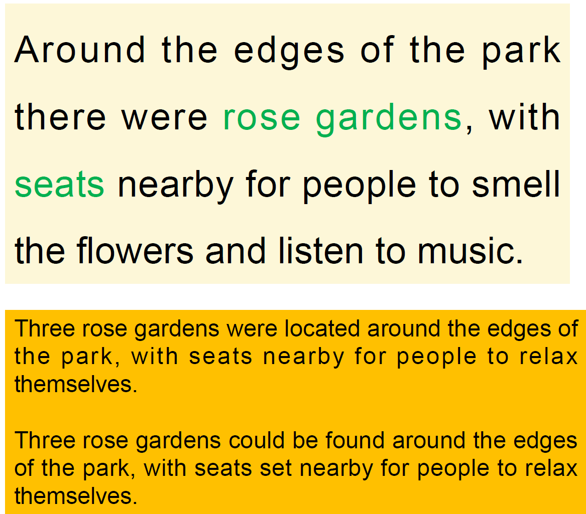

可使用with句式，...be located in, with ... surrounded for ...

## 具体详细描述地图

How to describe a map?

1. 位置（绝对位置，什么地方有什么）
2. 关系（相对位置，地理要素之间的相互关系）
3. 变化（时间前后的变化）

### 一、描述绝对位置

There was a fountain in the centre, with a stage for musicians situated centre left, a glasshouse to the right of the Eldon Street entrance and a pond for water plants in the north east corner opposite.

首先可以使用"There be"句型，之后用with连接从句，后面地理要素用"with ... located/situated/lay in/sited in/at ... left/right，之后再用一个逗号并列连接一个从句，与刚刚相同格式，最后一个用and连接。

其中如果有描述河流，道路走向的用southeast-to-southwest，动词的话可以用stretching, lying, locating等

例如：

主动：There is a scenic road stretching southeast-to-southwest, lined with vibrant trees and leading to the picturesque village nestled in the valley.

被动：There is a scenic road, with lush trees lining its path, located southeast-to-southwest and leading to the picturesque village nestled in the valley.

## 二、描述关系

There was a fountain in the centre, with a stage for musicians situated centre left, a glasshouse was to the right of the Eldon Street entrance ...

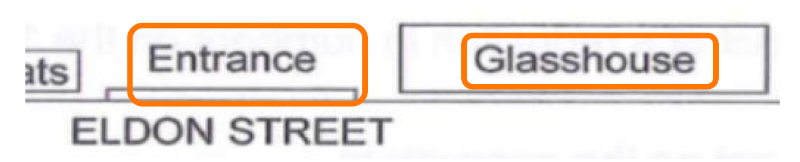

1. 用"... be to the north/ south/west/east/left/right of..."
2. 方位介词（in front of/ behind/ near/ next to/ along/ around...)

In front of the edges of the park, there were rose gardens.

3. on the north/south/west/east side of...

A rectangular area with access from Arnold Avenue on the north and from Eldon Street on the west side.

somewhere from ... on the north/south(side)

### vocabulary

surround v. 包围

link//connect v. 连接

across adv./prep. 穿过

close to 在附近

be adjacent to 临近

## 三、描述变化

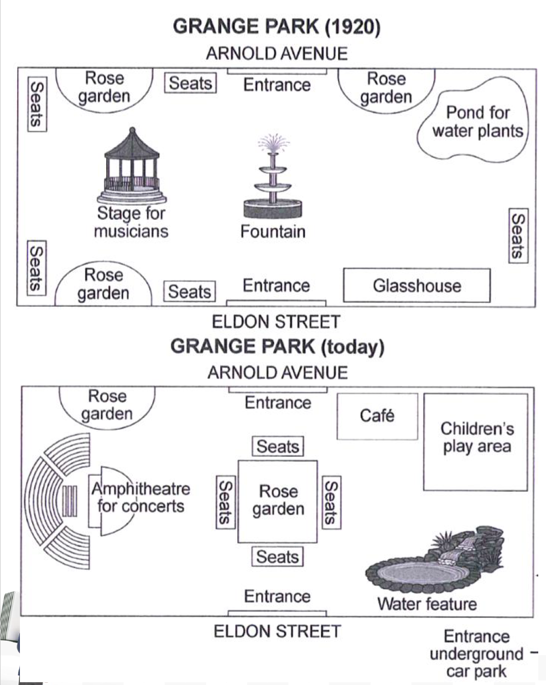

除了Arnold avenue、Eldon avenue的入口和左上角的rose garden...

注意框外的路也要包括

变化：

1. fountain >> a largeish garden with seats (in the centre)
2. bandstand>> Amphitheatre for concerts(to the left)
3. glasshouse >> water feature
4. pond for water plants >> children’s play area
5. a new entrance (from an underground car park)
6. a new cafe

起始句：The park has altered considerably since then. 

1. Now there is one largeish(非正式形容词) rose garden, occupying the central area where the fountain stood, and with seats around it.

There be..., doing..., with...方位介词.

0. One of the smaller rose gardens remains on the north side of the park, the other one has been replaced by a new cafe, where people can take a short break while iterating the park.

2. The bandstand(stage for musicians) has also been replaced by an amphitheatre for concerts and associated seating. 
3. The glasshouse has gone and in its place is a water feature.
4. Similarly, where the pond for water plants stood there is now a children's play area with a cafe nearby.
5. Access to the park is still via the two original entrances, but there is now a third entrance near the water feature from an underground car park.

### 描述方法

#### 有——无

原来：original; previous; former

拆除：demolish; knock down; remove; dismantle

消失：disappear; go

新修：build; construct; establish; add

取代：

1. A is replaced/substituted/converted by B
2. A is demolished to give way to the construction of B
3. There be B, occupying the xxx area where the A stood
4. Where the A stood there is now B

#### 变化主语-设施/变化/地名

##### 建筑设施作主语

1. Some... were built + 方位, replacing ...(旧的建筑设施)
2. The 建筑设施 which used to dominate the 年份 map had been replaced by 建筑 by 年份
3. In 过去年份, there was a 旧建筑设施+方位, whereas now the 新建筑 is there.

##### 变化名词作主语

1. The main change was the addition of ...(新建筑设施)+方位 which **necessitated** the demolition of ...(旧建筑设施)
2. The most striking alternation is to ....(旧), with... and ...(变化)
3. The removal/ demolition of ...(旧建筑设施)+方位 **made room for**.../ gave way to ...(新建筑设施)

##### 地图作主语

... underwent further changes with the removal of ...(旧建筑设施)

e.g.

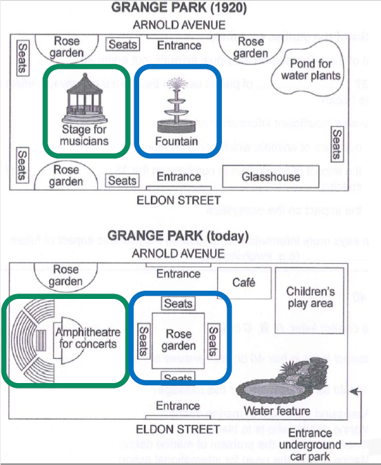

green: The bandstand(stage for musicians) has also been replaced, by an amphitheatre for concerts and associated seating.

blue: The fountain which was located in the park centre has been replaced, by a large rose garden with four sets of seats.

or

blue: Where the previous fountain stood there is now a rose garden surrounded by seats.

#### 大——小

扩大：extend(线性); expand(辐射); increase in size

缩小：narrow down; shrink(shrunk, shrunken); reduce in size

倍数：be (twice) as large as; double

e.g. Gym的面积将几乎是原来的两倍

The size of the gym will be almost twice as large as what it used to be.

Gym的面积在重建后翻了一倍

The size of the gym double after the reconstruction.

##### 特殊情况——路分支延申

The main road is extended to east and north.

#### 多——少

The number of... increase/decrease

special:

#### 不变

The build remains(unchanged); sth is still...; There is no change in this building.

e.g.

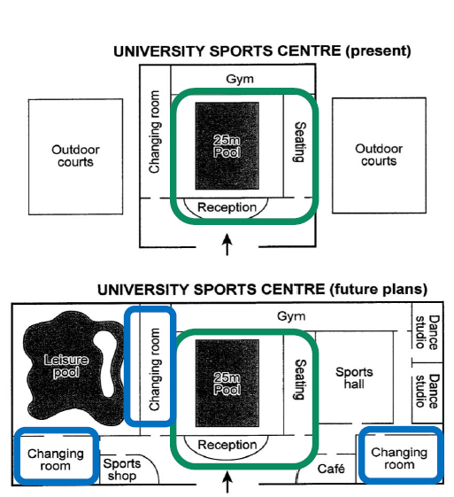

(green)There will be no change in the pool, the seating area and the reception.

The number of the changing room will increase: the current one to the west of the 25m pool will remain the same, while two extra/ additional ones will be built in the southeast and the southwest of the center.

#### Overview

1. 适用于基本都变了的地图

Overall, the [地图内容] has been developed significantly over the [时间] years. This development (mainly) occurred in the [绝对方位] of the [地图内容], providing more [变化内容].

2. Despite the apparently significant changes, the [地图内容] retains [没有变化的内容], with the addition of [变化内容].

e.g.

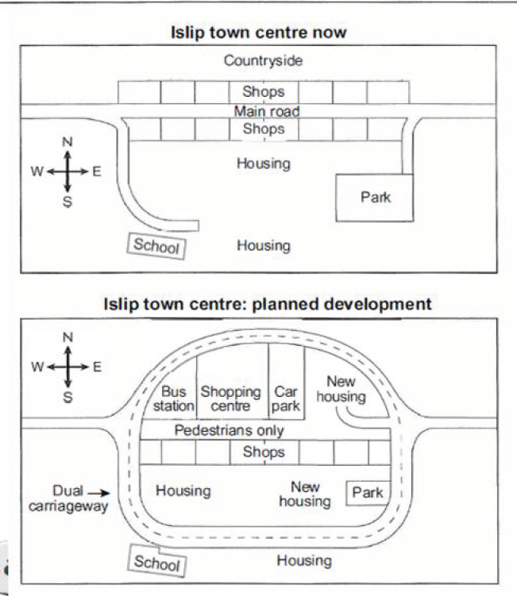

Despite the apparently significant changes, the town centre will retain in its southern part, with the addition of housing and traffic.

## Flowchart

首先： 

the process begins when

Initially,
At the first stage/ During the initial phase

然后：

After that/ Then/ Subsequently/ At the second/ next phase

最后：

Finally, 

At the final stage/ phase,

e.g.

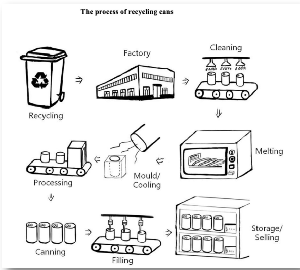

首先观察图片中可以提取出的基础动作，有以下几个：

collect-deliver-clean-melt-cool&mould-process-can-fill up-store&sell

拓展：目的

clean的目的——remove impurities

cool的目的——lower the temperature

文段可以分成以下部分：

2 Introduction, 1Overview, severeal Main Features, 1 Overview

#### Introduction

改写原题，简单陈述$\to$ 概括过程有几个步骤

The diagram/ flow chart illustrates/ shows the process of...

1. There are...(number) stages of this process.
2. It mainly includes/ involves/ consists of xxx stages.
3. The whole process can be divided/ categorised into (num) of stages.

e.g. The flow chart illustrates the process of recycling cans and the whole process canbe divided into eight stages.

#### Main body $\times$ 2

1. 包含每一个步骤，但并非所有细节
2. 包括已经出现的在图中的名词，动作描述

#### Overview

Overall, the diagram shows how...

#### Introduction

e.g.1 The diagrams below show the stages and equipment used in the cement-making process, and how cement is used to produce concrete for building purposes.

==The diagram/ flow chart illustrates/ shows the process of/ how sth is done...==

$\downarrow$

The first diagram illustrates how cement is produced. The second diagram shows the process if concrete-making.

e.g.2 The diagrams below show the life cycle of silkworm and the stages in the production of silk cloth.

==The diagram/ flow chart illustrates/ shows the process of/ how sth is done...==

$\downarrow$

The first diagram shows that there are four main stages in the life of the silk worm, while the second one illustrates how silk is extracted from cocoons to produce cloth.

#### Main body

如果是周期图的话一定要看清楚最开始的状态，不要看错了。

如上图Lifecycle of the silkworm:

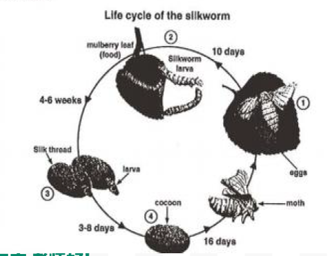

$1\to 2$: First of all, eggs are produced by the moth and it takes ten days for each egg to become a silkworm larva(幼虫) that feeds on mulberry leaves. 

$2\to 3$: This stage lasts for up to six weeks until the larva produces a cocoon of silk thread around itself.

$3\to 4$: After a period of about three weeks, the adult moths eventually emerge from these cocoons ==and the life cycle begins again.==(周而复始)

##### main body 句型写法

1. 被动单句：

材料+（被）动词+介词（in/by）+工具

2. 单句合并

Before, after, once, and或者定语从句

3. 句间衔接

时间顺序关键词

句内复合：

1. 句子...before sth is done
2. Once/ After sth has been done, ... is done.
3. A is delivered to a factory, where A is done.
4. 句子...sth, which is then done...
5. As sth travels along sth(conveyor belt), ... 句子

句间：

1. To begin with,...+句子
2. First/Second/Next/Then/Finally, ...+句子
3. Afterwards,...+句子
4. This stage of the process has to be...
5. At this point,...+句子
6. After this/that, ...+句子

e.g.衔接两张图中的信息

The cocoons are the raw material used for the production of silk cloth.

用被动描述步骤(注意Once后面不用接being done，而是直接写done)

Once selected, they are boiled in water and the threads can be separated in the unwinding stage.

定语从句描述步骤

Each thread is between 300 and metres long, which means they can be twisted together, dyed and then used to produce cloth in the weaving stage.

##### 句间衔接（时间顺序关键词）

首先：

the process begins when +句子

Initially, +句子

At the first stage/ During the initial phase, +句子

然后：

After that/ Then/ Subsequently/ At the second/ next phase, +句子

The next step in the process is +动名词/that +从句

The next step is to do

最后：

At the final stage/phase, +句子

动名词+is the last step in the procedure

同时：

at the same time/ simultaneously

结果：

consequently/ as a result/ so that

期间：

during/ in the course of

目的：

in order to/ in order not to/ in order that/ so as (not) to...

#### Overview总结段

##### 事物制成所需步骤

1. The diagram shows how **sth** is made in **num** stages.
2. It is clear that there are **num** stages/steps of making A, from the initial step of ____ to the final step of ____ (始末步骤总结)
3. There are **num** stages in making **sth**. The whole process starts with ____ and ends with ____.(始末步骤总结)

##### 人力/设备

1. There are many people involved in making **sth**
2. There are **num** sets of equipment used before **sth** is done.

e.g.上述回收cans流程图

Overall, there are **eight main stages** in recycling cans. The whole process **starts with collecting and ends with selling again**. Four sets of equipment are involved before cans are recycled.

e.g.上述silk流程图

Overall, the diagrams show that the cocoon stage of the silkworm can be used to produce silk cloth through a very simple process.

### 完整文段

The diagram illustrates how cans are recycled.

First, used cans are collected. Next/Then/Second, these cans are delivered to a factory, where they are cleaned. This removes the impurities.

The following/ next stage is to melt the cans into liquid and then pour the liquid into a mould. At the same time, it is cooled by another machine in order to lower the temperature.

Next/Then, the mould is put onto a belt so that it can be processed into a new can. Once the canning stage has been completed, the cans are filled with different drinks or foods. Finally, they are stored and then sold in vending machines.

Overall, there are nine main stages in recycling cans. The whole process starts with collecting and ends with selling again.