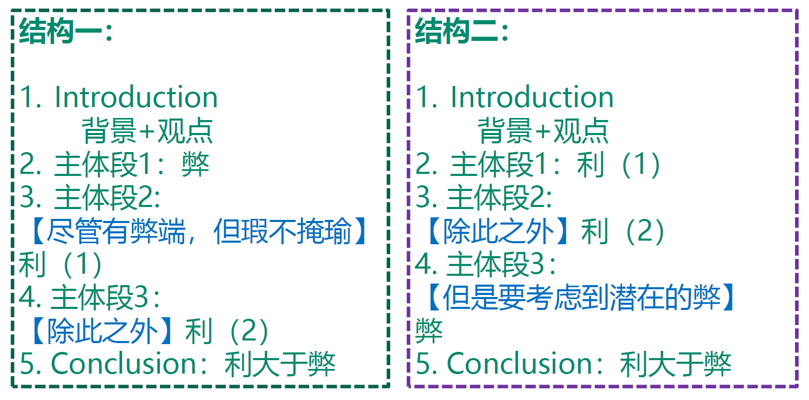

## Task2 大作文

题型分析

考试频率从上到下依次排列

### 写作结构

分为三段式：

Introduction: Background sentence 背景句 + Statement sentence 立场句

Detailed paragraphs: Topic sentence中心句 + Supporting sentences 支撑句 + （Concluding sentence 结尾句）

Conclusion: Summary of key ideas要点总结 + Restatement 立场重申 + （Advisory comments 建议愿景）

## Agree or disagree 同意与否

### 立场

Example: Although more and more people read news on the internet, newspapers will remain the most important source of news. To what extent do you agree or disagree with this opinion?

完全同意：I fully agree with this statement, and I will explain why in this essay.

完全不同意：I strongly disagree with this view, and ...

I believe that newspapers have lost their appeal in most readers' eyes and the internet has replaced the former as the major source of information.

#### 结构表达

完全同意或者反对：In my opinion,/ From my perspective, I fully/ totally/ completely/ strongly agree or disagree with the view.

大部分同意或者反对：

1. I tend to agree or disagree with the view to a large extent.
2. While/Although..., I would argue that...
3. Despite..., I believe that...
4. While sth is undeniably essential(不可否认的很重要), I would argue that other...(B) is just as important/ equally important.
5. The idea of ... may be initially appealing(表面看起来很吸引人), but some analysis will show that it is not the key method and that other options are preferable.
6. However, I disagree with the idea that...because...
7. However, it is by no means that.

例子中大部分同意或者反对answer：

Despite the reliability and authority of traditional newspapers, with the development of the Internet, I would argue that online media has become just the same important as physical ones.

While traditional newspapers are undeniably essential, I would argue that the Internet is just equally important in terms of acquiring news.

## 开头段

第一句进行同义替换，可以替换词汇语法结构等。

第二句表达观点

### 改写句

一般来说改写句用It is 结构或者There is 结构会好一些

原文：More and more people are moving from rural areas to cities.

改写句：It is fact that an increasing number of people are migrating from countryside to urban areas.

妙词：migrating

用迁徙的意思完美替换了moving

原文： Students in university should specialize in one subject rather than developing a wide range of subjects.

改写句：There is a long-standing debate about university students' option of subject learning.

Paraphrase:
teachers -- educators/ schooling
parents -- caregivers/parenting
play an influential role in
intelligence and sociability

## 结尾段

开头段：Despite the increasing popularity of online news, newspapers are still believed to be the main source of news for most people. I fully agree with this statement, and I will explain why in this essay.

结尾段：In conclusion, because of its reliability and penetration, newspapers will continue to have an important role to play in spreading information.

结尾段首先写出文章中论述的观点（精简词），把这个当作原因，然后再改写一下观点句作为下一句就行。

Example：

开头段：Parental education is regarded as the best method to curb juvenile crime. In my opinion, this combined with assistance from schools can best serve the purpose of youth crime prevention.

Conclusion：

In conclusion, parenting skills and school education are both contributing factors to minimizing juvenile delinquency.

## 思路

对象：

1. 组织
2. 个人
3. 社会

领域：

1. 政治
2. 经济
3. 科技

### 多维度（全面拓展）

Example:

The best way to reduce youth crime is to educate parents about good parenting skills. To what extent do you agree or disagree?

思路分为两个部分，其一是同意，那也就是从个人（家长）的角度来展开

其二是不同意，那也就是从社会（媒体，网络）和组织（学校）上来讨论

从家长的角度展开：

教父母育儿→父母言传身教→降低青少年犯罪

1. having good parenting skills(for parents)
2. directing children towards positive attitudes and behaviors.
3. equip their children with the ability to tell right from wrong.

Parental guidance, of course, is of importance to reducing the number of crimes conducted by teenagers. This is because parents, armed with proper parenting skills, have a primary role in directing their children towards positive attitudes and behavior. With constant redirecting when children go wrong, parents can teach them right from wrong, which would keep their children away from illegal activities.

从学校和老师的角度展开

学校和老师的教导→老师管教，学校开设课外活动、讲座→降低青少年犯罪

1. good teaching skills(for teachers and schools)
2. extracurricular activities such as volunteer work;lectures about how to give helping hand to others.
3. learn how to contribute → become acceptable members with moral compass in their mind.

Teachers and schools can also contribute to preventing youth crime. Since high school students would go to school for education and spend most of
their daytime at school, teachers and schools are responsible for students’ behavioral issues.

### 具体化（充足论证）

Example:

Social skills are as important as good qualifications for success in a job. Do you agree or disagree?

思路：

有社交技能→处理好和同事关系，工作效率可能会更高→社交技能对于职业成功重要

Social skills: cooperation, teamwork, communication, listening, empathy, sharing

Success in a job: earn more money, promotion, greater work efficiency, good relationships, with colleagues, finish projects

Cooperation is especially important when individual employees work on a team. This is because they need to work alongside their colleagues to achieve a common goal. If one refuses to cooperate with others and consequently fails to fulfil their responsibilities in a team, then this,
creating a domino effect, may result in the collapse of the entire project.

#### 具体化练习

Although more and more people read news on the Internet, newspapers will remain the most important source of news.
To what extent do you agree or disagree?

Para1

The Internet is beginning to rival newspapers as the best
place to find information about what is happening in the
world. I believe that this trend will continue, and the Internet
will soon be just as important as the traditional ones.

Para2(具体介绍newspapers)

On the one hand, newspapers will continue to be a vital
source of news in the Internet age. 

A major reason for this is
newspapers are widely regarded as the most traditional
means of news communication. 

Most people today still enjoy
the experience of holding and reading newspapers rather
than browsing news on a screen. 

Additionally, newspapers
can be trusted as the most reliable source of news, as they
are edited and proofread by professional journalists and
editors. This feature makes it an authoritative source in many
people’s eyes.

Para3(具体介绍互联网)

[...]Another reason lies in that the Internet can serve
as a platform where people can share comments on
what they have read.

If they can discuss together and give their opinions
right below the news, information from different
social media such as Facebook and Twitter can be
gathered and exchanged immediately, therefore
providing a more comprehensive and objective
understanding for news-readers .

Para4(结尾)

In conclusion, I disagree that traditional
newspapers will remain the most important
source, as the Internet can offer information
more flexibly and effectively than newspapers
do.

## 分情况讨论（辨证思考）

Social skills are as important as qualifications for success in a job. Do you agree or disagree?

## 主体段拓展方法

中心句→解释，举例→**==对比，反证法==**→结果

Example:
Some people think young people are not suitable for important positions in the government, while other people think it is a good idea for young people to take on these positions.

Discuss both views and give your own opinion.

To begin with, some believe that it is not proper to give the reins of a nation in raw hands. This is because people without experience in decision-making positions are likely to misjudge a situation and consequently make an unwise decision that would be later proved wrong, if not fatal.

Expansion例子: For example, if a fresh graduate held a senior position in military, the immature in charge, due to lack of field experience, would be unable to run a remote team and manage military operations.

例子要支持你的观点
P – point
E – explanation
E – extension

Parental guidance, of course, is of importance to reducing the number of crimes conducted by teenagers. This is because parents, armed with proper parenting skills, have a primary role in directing their children towards positive attitudes and behaviour. With constant redirecting when children go wrong, parents can teach them right from wrong, which would keep their children away from illegal activities.

For example, when parents find their child shoplifting from a supermarket, they should tell the child shoplifting is unacceptable.

这里主要是具体指出可以去做的事，将上面一段方法论实际化变成行动方式。

如果还要再拓展，可以在讲述完实际方式后加上强调结果

This could deter the child from committing crime, thereby reducing the crime rate of adolescents.

==结构：例子+代词This...（这件事会导致的结果）+从句/thereby强调最终结果==

### 对比/反证

Examples:

反面例子：

Cooperation is especially important when individual employees work on a team. This is because they need to work alongside their colleagues to achieve a common goal. If one refuses to cooperate with others and consequently fails to fulfil their responsibilities in a team, then this, creating a domino effect, may result in the collapse of the entire project.

↓加入对比（正面例子）

By contrast, teamwork makes the difference between success and failure in the workplace. In a cooperation-rich workplace, it is likely that people are more open to negotiation and refinement and therefore get a mission accomplished through collaboration.

或者先总结，然后再说反面，最后正面

Examples:

(总结)

Education and job training are of importance to help ex-convicts to find legal sources of income, and thus serve as an effective deterrent against further crimes.

（反面）

This is particularly the case for criminals from impoverished areas who have been deprived of formal education. ==Without qualifications and employment skills, these people have no choice but to commit criminal offences ranging from shoplifting, theft and robbery for a living.==

（正面）

If, therefore, they were ever given access to education or vocational training, and subsequently were to find employment with a steady income, they would never recommit a crime out of unemployment and poverty.

## 文章结构

# 利弊分析

examples:
Some experts believe that it is better for children to  begin learning a foreign language at primary school  rather than secondary school. Do the advantages of this outweigh the disadvantages?

学习效果好：

1. pick up language more easily
2. maintain enthusiasm & progress
3. learn other languages more easily
4. better understanding of other cultures

学习效果不好：

1. slow progress
2. demotivated

在写作中advantages和disadvantages都要写，但是具体哪方面更加突出则是可以选择的。

## outweigh & positive/negative

**‘outweigh’类题目**
**• 不能一边倒**
**• 不只是罗列优缺点，** **一定要对比**
**• 对比重要性或价值**

**第二类positive/negative/agree/disagree题目**
**• 可以一边倒**
**• 也可以折中**
**• 类似Do you agree or disagree类题目**

Example(outweigh):

Many museums charge for admission while others are free. Do you think the advantages of charging people for admission to museums outweigh the disadvantages?

## 开头段

The question of whether museums should charge for admission or remain free has been a subject of debate for many years.

好处大于坏处：

In my opinion, the drawbacks of an entrance fee are eclipsed by its benefits in the sense that the income will be ploughed back into operation and development of the museums.

坏处大于好处：

While I accept that charging for admission can have some positive effects, I believe that it is more likely to have a harmful impact.

立场句常用表达：

1. 完全的积极/消极趋势

In my opinion,/From my perspective, I would argue that this is an entirely positive/negative development

2. 优点更多 OR 缺点更多

Although/While + 从句, 主句

While/Although there are some drawbacks/benefits, I would argue that there are far more benefits/drawbacks.

Despite + 名词性结构, 主句

Despite some drawbacks, I would argue that this has far more benefits.

• benefits play a bigger role than drawacks
• benefits outweigh/override drawbacks
• drawbacks cannot simply justify benefits
• benefits cannot be ignored

## 结尾段

In conclusion, the disadvantages of an admission fee are overshadowed by the benefits accruing from a
stable source of income. Therefore, having weighed up the pros and cons, I am convinced that museums
should charge an entrance fee for the sake of operation and development.

In conclusion, it seems to me that the potential dangers of charging for admission are more significant than the possible benefits.

## 过程段

在中间段，需要分析利与弊，同时最终也需要得出结论。

结构一：

衔接句：

第一次弊端展开

1. Indeed, it is true that......
2. It would seem that...
3. However, compared with the positive/ negative impacts, the negative/ positive outcomes would seem insignificant.

利展开1

1. Above all...
2. To begin with,...

利展开2

1. On top of this/ Apart from that,...
2. To go further,...
3. What is more/ Besides/ In addition/ Additionally,...

结构二：

衔接句：

利展开1

1. Above all...
2. To begin with,...

利展开2

1. On top of this/ Apart from that,...
2. To go further,...
3. What is more/ Besides/ In addition/ Additionally,...

潜在弊端展开

However, there are certain potentially beneficial/detrimental influences that cannot be neglected/ ignored/ overlooked.

## positive/negative

In many countries, many more people are choosing to living alone nowadays than in the past.
Do you think it is a positive or negative trend?

这里就不用特意去选出哪个更重要了，直接讨论一个事物的好与坏两个方面就行。

## 主体段

example:

Some experts believe that it is better for children to begin learning a foreign language at primary school rather than secondary school. Do the advantages of this outweigh the disadvantages?

**positive:**

The obvious argument in its favour is that young children pick up languages much more easily than teenagers. Their brains are still programmed to acquire their mother tongue, which facilitates learning another language, and unlike adolescents, they are not inhibited by self-consciousness.

The greater flexibility of the primary timetable allows for more frequent, shorter sessions and for a play-centered approach, thus maintaining learners’ enthusiasm and
progress.
Their command of the language in later life will benefit from this early exposure, while learning other languages subsequently will be easier for them.
As language reflects its cultures, these early learners may also gain a better understanding of other cultures.

**negative:**

There are, however, some disadvantages. Primary school teachers are generalists, and may not have the necessary language skills themselves. If specialists have to be brought in to deliver these sessions, the flexibility referred to above is diminished. If primary language teaching is not standardized, secondary schools could be faced with a great variety of levels in different languages within their intake, resulting in a classroom experience which undoes the earlier gains. There is no advantage if enthusiastic primary pupils become demotivated as soon as they change schools. However, these issues can be addressed strategically within the policy adopted.
