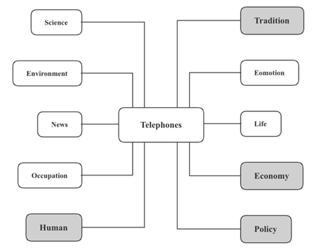

# 文化传统

本节涵盖三个主要的方向：

1. 文化传统
2. 文化交流
3. 艺术价值

# 文化保护

关于这个方向可以从保护的原因、措施，或者不保护的理由等几个角度出发来准备

## 保护的原因

### 人类人才

1. **区分人类和其他物种**(separate human beings from the rest of living world)的**可靠记录**（a proven track record）
2. **提供身份认知和归属感**(provide a sense of identity and belonging)
3. **区分国家身份**(differentiate national identities)的符号
4. **族群**(ethnic group)内的**重要连接** (a vital connection)
5. **一种思维方式** (a way of thinking)
6. 独一无二的**解读世界**(interpret the world)的方式
7. **智慧的财富** (the wealth of wisdom)

8. 提醒一个社会**过往功绩或损失** (past achievements or losses)

### 传统文化

1. **文化的载体** (carriers of culture)
2. **代表** (represent)一个国家**独一无二的历史，文化和传统** (unique history, culture and traditions)
3. 一个**国家遗产** (a country’s heritage)的一部分
4. **被看作是**(be considered to be) **艺术品** (works of art)
5. **保留文化多样性**(maintain cultural diversity)
6. 与文明**紧密交织在一起** (be closely intertwined with)
7. 在**维护和加强国家认同感**(maintain and reinforce a nation’s identity)中**起到关键作用**(play a key role)
8. 用于**祭拜的场所**(places of worship)**应当得到维护**(deserves to be maintained)
9. 维护一个群体**共享的文化认同**(shared cultural identity)

10. **濒危语言的灭绝**(extinction of endangered languages)使**考古学家**(archaeologists)和**历史学家**(historians)无法研究相关文化

### 经济商业

1. **文化特色**(cultural features)**吸引游客**(attract tourists)并**促进当地经济发展** (promote local economic development)

2. **历史建筑**(historical buildings)**作为旅游景点**，**给当地政府带来更多的收入** (might act as tourist attractions to bring more capital to the local government)

3. **文化同化**(cultural assimilation)以及**去地区化**(delocalization)令**地方产业**(local industry)**倒闭**(go out of business)

### 科学技术

1. **揭示人类发展进程**(reveal the process of human development)

2. **古老建筑工艺和建筑材料**(antique building craft and materials)**具有研究价值**(would have research values)

### 环境保护

1. 被认作是**最大程度的回收**(the ultimate form of recycling)
2. **减少对于新材料的需求**(reduce the need for new materials)
3. **减少建筑垃圾**(reduce construction wastes)

4. **节省花费在生产、运输建筑材料和工具上的能源**(save the energy spent on manufacturing and transporting building materials and tools)

### 生命生活

1. **一种生活方式**(a way of life)**伴随着一种语言的消失而消失** (may disappear with a language vanishing)
2. **濒危语言**(dying tongue)是**一种交流方式**(a means of communication)
3. **文化同质**(cultural homogeneity) **会使世界无聊** (renders the world boring)

4. 对于历史的保护**可以增强文化多元性**(may enhance culture diversity)

## 保护的措施

### 政府政策

1. **开展本地文化振兴活动** (launch culture revitalization programs)
2. **资助振兴活动** (can fund or finance reviving activities)
3. **以促进旅游业发展来保护老建筑**(promote the development of tourism to protect old buildings)
4. **鼓励公司和个人捐款**(encourage companies and individuals to donate)，**利用老房子开展各种活动**(make use of old houses to hold some activities)，**引起人们对老房子的关注**(draw people’s attention to the old buildings)
5. 语言学家linguist通过**编纂字典**(make dictionaries)、**记录历史和传统**(record histories and traditions)、以及翻译口头故事等方式来**记录和存档正在消失的语言** (document and archive the disappearing languages)
6. **对语言进行录音** (record the language)
7. **记录或者拍摄历史资料** (write down or photograph historical materials)
8. 本地社区**开设语言课程**(offer courses on the disappearing languages)，**保证年轻一代人学习并且传承这种语言**(may help ensure that younger generations learn and inherit them)

9. **组织非营利性的活动** (organize non-profit activities)，**宣传老房子保护的重要性**(publicize the importance of protecting old buildings)

### 新闻媒体

1. **拍摄纪录片**(make documentaries)
2. 提升公民**文化保护**(culture preservation)的意识

3. **公益宣传片**(public service advertising)

## 不保护的理由

### 生命生活

1. 有些文化习俗是**跟当代生活理念相违背** (be against current lifestyles)
2. 一些**陈旧的传统**(outdated traditions)**阻碍当代社会的发展**(impede the development of modern society)，比如**性别不平等**(gender inequality)和**盲目遵从长辈命令**(follow seniors’ orders blindly)
3. 有些文化**被视为当代人的负担**(be treated as a burden of modern people)
4. 有些文化习俗**是反人性的**(be against human nature)
5. 生活在破旧的房子里，人们的**生活质量**(standard of living)低，且**幸福指数也会降低**(may lead to a decrease in their happiness index)
6. **破旧的房子**(houses in a poor condition)长期没有维修，**危险系数**(the risk of danger)高
7. 一些**破旧的且没有历史意义的房子**(dilapidated houses without historic value)**会影响城市形象**(can negatively influence city’s image)
8. 为了保护文化而**牺牲现代社会的特征**(sacrifice the features of modern society)是没有意义的
9. 使用通用语(the utilization of lingua franca)交流更加方便
10. 更少语言**促使社会统一**(enable individuals to unite as a country)

11. 一个国家的民族自豪感**应当来源于其当前状况和未来潜力，而非其历史**(should come from its current state and future potential rather than its history)

### 经济商业

1. 文化的保护**需要大量的资金支持**(would need a great deal of financial support)
2. **维修老房子**(the renovation of old houses)需要大量**政府资金**(government capital)
3. **财政负担过重**(can be financially overburdened)
4. **导致失调的经济**( could lead to a dysfunctional economy)
5. 和科技相比，文化保护很难给人们带来**实用价值**(material value)
6. **占用太多的城市土地**(occupy a great deal of land in cities)
7. **不利于城市化的发展**(may bring disadvantages to the development of urbanization)

8. **不利于城市建设和旅游业的发展**(play a negative role in the construction of a city and the development of tourism)

# 文化交流

这个部分可以从多元文化交流的益处和弊端来考虑

## 多元文化交流的益处

### 文化传统

1. 了解其他文化及其生活方式 can learn about cultures and their lifestyles
2. 促进多元文化理解与尊重并减少误解 will promote multicultural understanding and respect, and reduce misunderstanding
3. 促进和平主义 will promote egalitarian
4. 让人们变得更加开明，更加有包容性 can help people become more open-minded and tolerant
5. 激发对多样性的包容 may engender tolerance for these differences
6. 为一个国家的发展带来活力和创新 will bring dynamism and innovation to a country's development
7. 丰富一个国家自己的文化can enrich a country's own culture

### 经济商业

1. **助力于日益增加的国际商业合作**(contribute to increasing business collaboration between countries)
2. **有助于商业贸易**(be beneficial to business trade)
3. **消除贸易壁垒**(will remove trade barriers)
4. **可能带来外商直接投资**(might bring foreign direct investment)
5. **带来更多样的产品**(will bring a broader range of products)
6. **刺激本地经济**(would stimulate local economy)
7. **拓展国际市场**(could expand international market)
8. **引进海外资金**(introduce overseas capital)
9. **学习先进的管理策略**(will obtain advanced management strategy)
10. **减少发展中国家的贫困问题**(will reduce poverty in the developing world)
11. **有助于全球标准的建立**，**比如工资与工作条件**(be beneficial to the establishment of global regulations, such as salaries and working condition)
12. **促进基础设施的建设**(will promote the build of better infrastructures)

13. 国际旅游给政府带来收入，可以用于**更好的文化遗产保护**(would better preserve cultural heritage)，比如古建筑

### 新闻媒体

1. **通过宣传**(through media publicity)，更多人**了解这种文化**(know the culture)，**增加保护意识** (raise the awareness of preservation)

### 生命生活

1. **多维角度思考问题**(think about problems from multiple dimensions)
2. **激发灵感，促进创新**(would ignite inspiration and increase creativity)
3. **带来丰富的食物**(will bring diverse cuisine and treats)
4. **学习或强化第二种甚至第三种语言**(learn or strengthen a second or third language)

5. **学习并采纳其他文化中的优良习惯**(learn good habits from other cultures and adopt them)

### 工作效率

1. **增加就业机会**(create more job opportunities)

2. **全球化的劳动力**(global workforce)**缓解老龄化带来的劳动力短缺**(may alleviate the seriousness of labor shortage brought by aging population)

## 多元文化交流的弊端

### 文化传统

1. **带来文化冲击**(will bring about cultural shock)
2. **文化多样性消失**(the disappearance of cultural diversity)
3. **导致文化同一性**(may lead to cultural uniformity)
4. **损害国民认同感**(impair national identity)
5. **削弱本国的文化**(will diminish local culture)
6. **削弱他们的文化认同感**(would erode their sense of cultural identity)
7. 熟悉相似性**破坏了当地文化的典型性**(will destroy elements of the local culture)
8. **产生了一个无聊的全球文化**(will produce a bland ‘global’ culture)
9. **破坏历史遗迹**(may wreck cultural heritage)
10. 本地文化和节日庆祝活动**可能会被扭曲，失去原本的意义**(can be distorted and lose their initial meaning)
11. **文化的商业化**(cultural commercialization)使其**与传统背离**(will detract from tradition)

12. **激发对其他文化的敌意**(may provoke hostility towards other cultures)

### 经济商业

1. **对本土企业构成威胁**(will threaten local businesses)
2. **使当地的竞争企业难以生存**(may drive their local rivals out of business)
3. **导致竞争激烈**(will give rise to fierce competition)
4. **提高当地人生活成本**(will increase costs of living for the locals)

5. 人口数量的快速变化**使当地经济不稳定**(will destabilize the local economy)

### 生命生活

1. **语言障碍**(language barriers)**可能导致社会隔绝**(may lead to social segregation)
2. 来自其他人（比如导游）的**片面解说**(one-sided picture)**可能导致偏见**(may contribute to prejudice)
3. **文化不同**(cultural difference)**导致猜忌和迫害**(will fuel suspicion and persecution)
4. 团队旅游而且不与本地人交流，只参观旅游景点，**导致成见**(can promote stereotypes)
5. **可能导致社会紧张**(may trigger social intension)
6. **招致社会动荡**(lead to social unrest)

7. 当**特定族群**(some groups)更加成功时，**会引发冲突和嫉妒**(will cause friction and envy)

### 环境保护

1. **当地环境**(local environment)**被破坏**(can be damaged)
2. **本地社区**(local community)**遭受垃圾乱丢的街道、污染的水源、及自然栖息地的消失和森林火灾等现象**(may suffer from litter-strewn streets, polluted waterways, loss of natural habitats and forest fires)
3. **文化旅游业**(cultural tourism)**导致资源耗竭**(may lead to depletion of natural resources)

4. **给自然带来压力**(put pressure on natural resources)

# 艺术价值

这个话题可以从文化艺术的好处、支持艺术的方式、不投资艺术的原因这三个角度来构思

## 文化艺术的好处

### 情感特质

5     **使人放松和休息**(enable people to relax and rest)

6     **帮助人们释放压力**(help people release pressure)

7     **消除疲劳**(eliminate fatigue)

8     **缓解紧张**(ease nerves)

9     **提高面对困难的心理承受能力**(improve their psychological ability to face difficulty)

10   **增强情感的细腻性、敏感性和灵活性**(enhance emotional sensitivity and flexibility)

11   **丰富和发展人们的精神生活**(enrich and develop people’s spiritual life)

12   **增强大脑可塑性**(encourage brain plasticity)

13   **变得更加有创造力**(become more creative)

14   **发展分析**和**逻辑论证的能力**(develop analytical ability and logical reasoning)

15   **提升认知能力**(improve cognitive ability)

16   **发展情感能力**(develop emotional ability)

17   **帮助人们进行思想沟通**(help people connect via their thoughts)

18   给自己和观众**提供美学感受**(provide an aesthetic experience)

19   **产生快乐的情绪**(generate feel-good hormone)

20   **减轻痛苦的情绪**(relieve sorrowful emotions)

21   **通过一系列的方式表达想象力**(express imagination in a range of forms and symbols)

22. 艺术创作**被用于教育囚犯和治疗精神疾病中**(be utilized in educating prisoners and psychological therapy)

### 传统文化

1. **代表历史、文化和传统** (represent history, culture and traditions)
2. **被视作是文化遗产**(be viewed as cultural heritage/relics)

3. **是研究历史的资料**(be materials to conduct historical research)

### 经济商业

1. **带动其他消费活动**(比如**购买纪念品**) (produce other consumptions e.g. purchase souvenirs)

### 生活生命

1. **提升城市形象**(improve a city’s image)
2. **丰富人民日常生活**(enrich public’s daily life)
3. **增强城市竞争力**(strengthen the competitiveness of a city )
4. **增加城市吸引力**(add to the attractiveness of a city)
5. **起到宗教作用**(provide religious functions)
6. **起到仪式性或标志的作用**(might serve as ritualistic and symbolic functions)
7. **起到政治宣传或商业作用**(be used in propagandas or commercialization )
8. **提高公共意识**(would raise public awareness)
9. **提升生活品质**(will promote quality of life)

10. **从不断增加的屏幕时间中得到一个休息的机会**(be an opportunity to have a break from an ever-increasing bouts of screen time)

## 支持艺术的方式

### 政府政策

1. 政府**有责任确保社会各个领域的平衡发展**(shoulder the responsibility to ensure the balanced development between different domains)
2. 政府的支持会**促使更多的普通人愿意从事艺术相关工作**(can promote the general public to more willingly engage in the work related to arts)
3. 政府的支持会让人们**意识到艺术研究重要性**(realize the importance of arts research)

4. 政府可以**通过纳税人的钱**(through taxpayers’ money)**获得更多资源**(have access to wider resources) 

### 经济商业

1. 有些**公司**(enterprises)在艺术方面进行投资从而**获取经济利益**(gain economic benefits)
2. 公司应该**肩负保护本国艺术和文化的社会责任**(carry the responsibility to protect the arts and the culture of their country )
3. 公司可以通过艺术投资去**拓展市场**(can expand the market)
4. 很多公司都需要艺术领域的人才，所以投资艺术**能够吸引更多的人才**(attract more talented people)
5. 艺术可以**增加一个公司的独特性**(heighten a company’s uniqueness)，例如景观**设计和办公设计**（landscape and office design）

6. 在艺术方面的投资可以帮助公司**提升形象**(enhance images)

### 新闻媒体

1. 艺术家可以在公共场所**宣传艺术的价值**(advertise the value of arts)，例如经验分享，来**吸引公众的注意**(draw public attention)
2. 艺术活动的**曝光率**(exposure rate)可以让公众**对艺术有更多的了解**(develop a deeper understanding)，愿意**在艺术品上投资**(invest in artefacts)

3. **大众传媒**(mass media)**可以帮助艺术家普及自己的作品、也让投资者看到自己的作品**(can help artists popularize their works and make them viewed by investors) 

## 不投资艺术的原因

### 商业经济

1. **只满足一部分人的需求**(meet the needs of the small portion of people)
2. 艺术对社会的价值**很难界定**(be difficult to be defined)
3. 有些艺术家的价值**无法直接体现出来**(cannot be directly reflected)

4. 艺术**无法**像许多其他学科一样**带来可量化和可衡量的好处**(cannot yield a quantifiable and measurable benefit)

### 工作效率

1. 艺术所带来的益处是间接且不确定的（intangible benefits）

2. 艺术**不能**像公共设施一样**给人们的日常生活提供便利**(cannot provide convenience to people’s daily life)

3. 艺术**不能**像医疗服务一样**有效地保护人们远离疾病**(cannot protect people from illness and diseases)

4. 艺术**不能让人们摆脱疾病的痛苦**(cannot help people get rid of physical suffering)