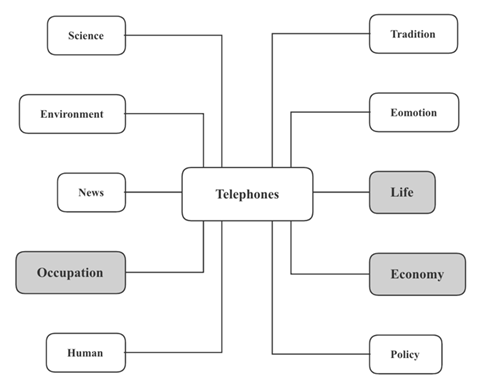

# 教育话题介绍

关于雅思写作中的教育话题包括以下三点：

1. 教育方式
2. 教育意义
3. 教育科技

# 教育方式

### 背景

随着技术的发展，越来越多的人开始重新审视去学校上课这种传统的教育方式，并开始尝试在家上课和线上上课等现代模式。那么学校教育是否能够完全被替代呢？

上述问题可以归结为两个大类：

1. **家庭与网络远程教育的优势**
2. **学校教育的重要性**

万能理由可以参考以下的图片（Telephones）：

这里选择**生命生活Life、工作效率Occupation、经济商业Economy、情感特质Emotion**这四个角度来构思。

## 家庭和网络远程教育的优势

### 经济商业Economy

1. 省去上学的路费 transport to school
2. 省去学校所需的相关开销 school-related expenses

因为没有了学校的实体 bricks and mortar，不用需要雇人去清洁以及维护 maintenance，能更加节约成本

### 生命生活Life

1. 免于遭受校园暴力 school bullying
2. 降低交通事故风险的概率 reduce the probability of traffic accidents
3. 更好照顾到 take better care of 一些特殊的学生，如有身体残疾 physical disabilities 或学习障碍的 learning disabilities
4. 学生可以提高生活技能 be more proficient at life skills 比如做饭打扫房间等 home education的好处...
5. 孩子**有充足的时间** （have ample time）**追求自己的兴趣爱好** （pursue their own hobbies and interests）

### 情感特质Emotion

1. 没有社交和朋辈压力 lower social or peer pressure，可以更真实表达和展现自我 express their true selves

### 工作效率

1. 熟练掌握 get familiar with 电脑常用软件使用 practical computer software，提高远程协作 collaborate remotely能力，提高就业力 employability
2. 不必辞退工作也可以继续接受教育
3. 减轻竞争压力 competitive pressure，提高自尊 boost self-esteem 和学习动力 learning motivation
4. 不用去学校，节省路上的时间和精力 save time and energy
5. 可以按照自己的偏好 personal preference 来安排学习时间，保障好的学习状态 ensure a positive state of learning，避免过度劳累avoid overwork
6. 可以按照自己的节奏学习 study at their own pace 而无需考虑其他学生 regardless of other students
7. 教学方法可以跟据每一个学生的学习习惯来制定（量身定做 tailor-made，使得学生以最佳水平学习 learn at an optimal level
8. 可以根据兴趣调整课程计划 adjust lesson plans
9. 父母可以亲自监督孩子学习 monitor
10. 通过回放录音录像 replay the audio or video 更方便复习
11. **锻炼时间管理能力**（practice time management skills）
12. 允许更灵活的时间安排 allow for a much more flexible schedule，学生可以自由调整日程 have the freedom to adjust schedules
13. 网上有丰富的资源 have an abundance of resources 可以学习到课程外的知识
14. 互联网宽带的增加 the increase in bandwidth of the Internet 和机器学习软件 machine learning software 能更好地针对个人优缺点 respond to an individual's strengths and weakness

## 学校教育的优势

### 情感特质Emotion

1. 更多机会与同龄人互动 interact with peers 并建立友谊 form friendship 
2. 同学和老师的鼓励 encouragement 有利于提高信心 improve confidence

### 人类人才Human

1. 定期参与 regular participation in 体育课和室外活动，有利于身体健康 is conducive to physical health
2. 老师和同学的鼓励可以缓解焦虑 relieve anxiety 等心理问题 psychological problems
3. 学校要求学生少吃垃圾食品 eat less junk food 并形成健康的饮食习惯 adopt healthy eating habits

### 工作效率

1. 团队活动培养团队意识 cultivate team spirit，提高合作能力 improve the ability to cooperate
2. 学会理解和照顾别人的感受 care for others' feelings，以及处理冲突deal with conflicts，提高社交能力 imporve social skills
3. 老师能够及时解答学生的疑问 answer students' questions in a timely way
4. 提供理想的学习分为 provide an ideal learning atmosphere，因为几乎没有让人分心的事物 distractions
5. 朋辈压力和老师的监督能保证学生按时完成任务 complete tasks on time，取得进步 make progress
6. 系统的教学计划 a systematic teaching plan 辅助 assit 学生定期复习，巩固  consolidate 所学知识
7. 组织定期考试 set regular examinations 能够及时发现学生的不足
8. 同学之间的竞争提供学习动力 provide motivation for learning
9. 学习基本的社会准则 basic social rules，如守时 punctuality、不能作弊等，以更好规范学生行为 better regulate students' behavior
10. 同学可以了解彼此的观点 learn from each other's perspective,因此学会从不同角度思考问题 think from different angles

### 生命生活

1. 保障学生远离 protect students from 犯罪crime 等危险因素
2. 学校的法制教育legal education 能够提升学生安全意识 enhance student's safety awareness

# 教育意义

面对教育意义相关考题，可以从TELEPHONES中的科学技术Science、工作效率Occupation、传统文化Tradition、情感特质Emotion、政府政策Policy、生命生活Life这六个角度构思

## 学校教育的作用

### 科学技术Science

1. 学习逻辑四维acquire logical thinking、理性态度rational attitude、分析技巧analytical skills
2. 学习分析以及解释数据analyse and interpret data，运用数学和计算思维computational thinking
3. 跟据证据进行论证engage in argument from evidence
4. 获取、评估和处理信息obtain, evaluate and process information
5. 掌握前沿技术master cutting-edge technology，及时了解keep up to date with技术和其他方面的发展
6. 拓展知识面expand the scope of knowledge
7. 了解自然和宇宙的基本规律rules of nature
8. 增加大脑活动，提高智力boost brain activities and promote intelligence

### 工作效率Occupation

1. 提升团队精神promote team spirit，合作能力
2. 提供解决问题的能力相关的训练provide useful training in problem-solving skills
3. 很好掌握沟通和社交能力，表达和分享观点get a good grasp of communication and social skills, express and share ideas
4. 培养领导力和管理能力develop leadership and management skills
5. 获取专业知识develop expertise和提供职业培训provide vocational training
6. 获得工作所需的资质和学历obtain qualifications and degrees required in the job market
7. 帮助在工作场所变得有竞争力become competitive in the workplace
8. 更擅长处理多重任务 be better at multi-tasking 和困难的脑力工作difficult mental tasks
9. 规范学生行为modify students' behaviours，让学生有礼貌have good manners
10. 树立道德上合理的价值观和世界观foster morally sound values and outlook
11. 区分是非对错distinguish right from wrong

### 传统文化（历史、语言、文学方面）Tradition

1. 学习批判性思考learn to think critically，理解不同的观点understand different perspectives
2. 提升读写能力promote literacy level
3. 提升表达和理解能力expressive and understanding skills
4. 学习想象力imaginative skill、创造性思维creative thinking、独创性originality
5. 具有**强烈的文化认同感和民族意识**（a strong sense of cultural identity and nationhood），有利于**统一** （unify the population）
6. **接受其他文化** （embrace other cultures）
7. **提升视觉认知能力和艺术技巧**（improve visual literacy and artistic skills）
8. **学习提高文学和艺术的鉴赏能力** (learn to grow an appreciation of art and literature)
9. **传承传统文化和民族习俗**（inherit traditional culture and national customs）
10. **从过去的错误中吸取教训**（learn from the past mistakes），避免将来再犯
11. **提升跨文化意识和理解**（increase cross-cultural awareness and understanding），**对于和自己不同的想法更加开放和包容** （be more open-minded and more tolerant to ideas different from their own）
12. 了解过去有助于我们**理解当前生活的各个方面**（appreciate the different aspects of life at present）

### 情感特质Emotions

1. **能够管理情绪**（be able to manage emotions）
2. 学习怎样**释放压力**（release pressure），**应对压力**（cope with stress）
3. **保持健康体重**（maintain a healthy weight）
4. **拥有积极乐观的人生态度**（have a positive attitude to life）
5. **鼓励积极的自尊心**（encourage good self-esteem）
6. 自我实现/自我探索，**塑造个性**（shape personalities）
7. **发掘天生的潜力**（develop inborn potentials）并**发现兴趣**（discover interests）
8. **树立信心**（build confidence），**取得成就感**（gain a sense of achievement）

9. **具备同理心和同情心**（have empathy and compassion）

### 经济商业

1. **受过良好教育的人**（well-educated people）可以从事更高水平的工作，从而**有利于国家的经济发展**（help boost the economy of the country）

### 政府政策

1. **成为有责任心和对社会有贡献的人才**（become responsible and contributing members of the community）
2. **学习公民知识**（learn civic knowledge），例如政府职能
3. **了解社会运行规律**（understand laws of society），如经济学和**政治理论**（political theory）
4. **掌握公民技能**（master civic skills）、尊重他人、保持平等公正、**积极参与社会活动**（actively participate in societal activities）
5. **变得关注时事**（become concerned about current affairs）
6. **意识到社会问题**（be aware of social issues）
7. **成为守法公民**（be a law-abiding citizen）

8. **为社会准备高质量的劳动力** （prepare qualified labour forces for society）

## 学校教育无法解决的问题

### 生命生活Life

a)     **理财能力**（financial skills），比如投资、**算税**（tax calculation）等

b)     **理性的消费行为** （rational buying behaviours）

c)     **家务技能**（household skills），比如烹饪、维护

d)     **时间管理能力**（time management）

e)     **自卫能力**（self-defense）

 f)     如何**给予急救**（give first aid）

### 工作效率Occupation

a)    职场中的**社交礼仪**（social etiquette），比如**与客户进行谈判**（negotiate with clients）等

b)    有关职场中的**着装规范**（dress code）

c)    **营销和管理方面的能力**（marketing and management skills）

d)    **创新思维技巧**（creative thinking skills）

e)    怎样**适应不断变化的就业市场**（adapt to a changing job market）

 f)    **灵活变通能力**（skills of flexibility）和**在快速变化的世界中生存**（survive in a rapidly changing world）

### 情感特质

1. 如何处理情绪control emotions
2. 如何处理压力 deal with streaa

# 教育科技

对于科技和教育的话题结合在一起，可以选择特技产品对于教育的积极和消极影响；这里选择TELEPHONES的Occupation、Life、Economy这三个角度来构思

## 教育科技的积极影响

### 工作效率Occupation

1. 声音、图像或视觉效果**有助于吸引注意力**（help gain attention），**保持学生的兴趣**（maintain students’ interest），并**激发学习热情**（stimulate learning enthusiasm）
2. 适度地看电视和玩电脑游戏有助于**培养兴趣**（develop interests），并**激发对该主题的进一步阅读**（inspire further reading on the topic）
3. 通过**模仿孩子喜欢的角色**（imitate children’s favorite characters）来学习良好的行为
4. **能够在短时间内展示复杂的概念**（be capable of showcasing complex concepts in a short period of time）
5. **学习更多课外知识**（learn more extra-curricular knowledge），**获取广泛的信息**（gain a broad spectrum of information）
6. 不仅限于**学科知识**（subject knowledge），**还涵盖与现实世界更紧密相关的社会问题**（cover social issues that are more closely related to the real world）
7. **让孩子们接触在日常生活中不会遇到的人和地方**(expose children to people and places they would not otherwise encounter in daily life)
8. **接触目标语言的会话节奏**(be exposure to the conversational rhythms of targeted language)，有助于提高语言学习中的听力能力
9. **提高识字水平**（improve literacy level），尤其是**提高语音意识**（raise phonetic awareness）
10. 对电视内容的讨论有助于**提高辩证思维能力**（improve the ability of critical thinking）
11. 玩电子游戏可以**提升解决问题的能力和创新力**（improve problem-solving abilities and creativity），因为玩家需要思考怎么通关升级
12. **促进逻辑思维**（boost logical thinking ）
13. 玩电子游戏可以**提高玩家的反应时间**（enhance players' reaction time）
14. **促进更好的手眼协调能力**（facilitate better hand-eye coordination）
15. 更好的团队精神和协作能力
16. 学会**使用网络与他人交流**（communicate with others online），这是一项将来工作中会用到的**实用技能**（a real-life skill）
17. **熟悉日常的电脑操作**（become familiar with computer skills），比如下载程序和安装**软件**（software）

18. 能够**有效率地利浏览互联网**（navigate the internet effectively）完成学校作业和**进行研究**（conduct research）

### 教育科技的消极影响

### 工作效率

1. **相比读书会占用更多时间**（take up more time than reading books ）
2. 容易使学生**上瘾**（become addicted）
3. **占用社交活动和体育锻炼的宝贵时间**（take up valuable time for social activities and physical exercise）
4. 很难**保持专注**（stay focused）
5. **未能获得太多知识**（fail to obtain much knowledge）
6. **仅与游戏中的人联系**（only connect with the people in games）
7. **导致社会脱节**（lead to social disconnection）
8. 很难**区分虚拟与现实**（distinguish the virtual from the real）
9. 不再**满足于现实生活**（feel satisfied with the real life）
10. **被动接收信息**（receive information passively），**大脑活动减少**（reduce brain activities），**影响创造力**（affect creativity adversely）
11. 信息呈现过于直接，**缺乏想象的空间**（leave no room for imagination），**限制想象力**（limit imaginative skills）
12. 看书过程中，读者需要从文字**推导出形象**（infer images from words），从而**提升想象力和创造力**（enhance imagination and creativity），而**在看电视过程中，想象空间被剥夺了**（be largely absent when watching TV）
13. **缺少语言的输出**（lack of language output）导致很难提升**口语和写作能力**（oral and writing skills）
14. 玩电子游戏会**缩短注意力集中时间**（shorten the concentration span），并**导致注意力不足障碍**（lead to attention deficit disorders），因为视频游戏只**需短期关注**（require short-term focus），这比课堂学习时要短得多
15. 仅仅**依靠多媒体**（rely on different media）的教师可能会**忽略课程的重点部分**（omit important parts of the curriculum）

### 经济商业

1. 现在节目**普遍商业化**（be widely commercialized），容易**引发冲动消费**（lead to impulsive buying）

2. 可以**通过互联网平台对孩子进行专门的广告宣传**（be specifically advertised to by internet platforms），从而**创造虚假的愿望或需求**（create artificial desires or needs）

### 生命生活

1. **损伤视力**（damage eyesight）
2. 长时间盯着屏幕会**导致眼疲劳**（lead to eyestrain）
3. **形成久坐的生活习惯**（adopt a sedentary lifestyle）
4. **导致肥胖和营养不良**（spark off problems of obesity and malnutrition）
5. 玩游戏**需要手部和腕部重复性的费力活动**（require repetitive and strenuous motion on the hands and wrists），这些会**导致发炎和损伤**（lead to inflammation and injury）

6. **缩短睡眠时间**（shorten sleeping time）和运动时间，**导致身体素质变差**（result in poor physical quality）

### 情感特质Emotion

1. **暴力色情内容导致心理问题**（violence and pornography cause psychological problems

2. 质量参差不齐，低质量的节目会**包含错误的信息或者不良的价值观**（contain false information or improper value）
