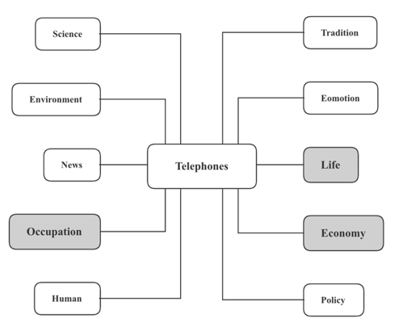

# 新闻媒体

本部分可以包括两种话题：

1. 新闻媒体
2. 印刷媒体

# 新闻媒体

关于新闻媒体，一大考察范围就是广告，则这里可以从广告的利弊两个角度出发，以及保护人们不受广告影响的措施

## 广告的好处

### 经济商业

1. **出于商业目的**(out of commercial purposes)
2. **让产品对消费者们更有吸引力**(make products more attractive to consumers)
3. **激发人们的购买欲**(generate the purchasing desire in people)
4. **很重要的市场营销工具**(could be an important marketing tool)
5. **促进广告产品的销量**(boost the sales of the advertised products)
6. **告知消费者新产品和服务**(inform consumers about new products or services)
7. **满足消费者需求**(satisfy the demands of the customers)
8. **为人们提供更多的选择**(provide people with more choices)
9. **吸引潜在的客户**(attract potential consumers)
10. **扩大潜在消费群**(expand potential consumer groups)
11. **塑造品牌形象**(shape brand image)
12. **让经济繁荣发展**(allow economy to thrive)
13. **提高利润**(boost profits)
14. **突出产品的质量**(highlight the product quality)
15. **扩大规模**(prompt expansion)

16. **增加政府税收**(lead to more taxes for the government)

### 工作效率

1. 创造工作机会create jobs

### 人类人才

1. **创造高品质的生活**(create a higher standard of living)
2. **具有美学价值**(possess an aesthetic value)
3. **一种现代艺术**(a form of modern art)
4. **提供视觉体验**(provide visual experience)
5. **重要信息来源**(could be an important source of information)
6. **得到放松和娱乐**(obtain relaxation and recreation)
7. **释放压力**(release pressure)
8. **激发儿童认知能力的发展**(can stimulate children’s cognitive development)
9. **信息量大的且有教育作用的**(can be informative and educational)
10. **提升儿童注意力**(increase the concentration of children)
11. **给儿童视觉和听觉的刺激**(provide children with audiovisual stimulus)
12. **扩大儿童的知识面**(expand the scope of knowledge in children)

### 生命生活

1. **给孩子提供多种选择**(provide children with more choices)
2. **让孩子扩大见识**(enable children to expand their horizon)
3. **让孩子从不同角度看待世界**(make children view the world from different perspectives)
4. **让孩子了解世界**(let children know more about the world)

5. **很多广告**(commercials)**介绍健康食品**(introduce healthy dietary options )

## 广告的坏处

### 生命生活

1. **劝说人们去追随最新的潮流**(will tempt people into following the latest trends)
2. **控制消费者的决策过程**(**hold sway** over the decision-making process of customers)
3. **促使消费者做出不理智决定**(may prompt consumers to make irrational decisions)
4. **被误导信息所左右**(can **be swayed by** misleading information)
5. **受到不良信息的影响**(may be susceptible to improper information)
6. **提供有误导性的信息**(provide misleading information)
7. **夸大效用**(**exaggerate** the effects of the products)
8. **推销垃圾食品**(sell junk food)
9. **让人们不满足自己的财产甚至不满足于真正的自己**(can make people no longer feel constantly satisfied with their possessions and with who they are)
10. **打断精彩节目**(interrupt television viewing)
11. **导致消费主义和物质主义的盛行**(lead to the prevalence of consumerism and materialism)
12. **造成道德沦丧**(can be partially responsible for deteriorating moral and ethical values)，因为广告**滋生社会问题**(may engender social issues)诸如**抽烟、酗酒和享乐主义生活方式**(smoking, excessive drinking and hedonistic lifestyle)
13. **被广告轰炸**(can be bombarded with advertisements)
14. **普及高脂、高糖食物**(popularize high-fat and high-sugar foods)，导致肥胖症和糖尿病(lead to obesity and diabetes)
15. **让消费者对产品产生错误认知**(may give consumers a false perception of the product)

16. **歪曲他们的产品**(could offer a distorted view of their products)

### 经济商业

1. **操纵人们消费超出其购买限额的产品**(manipulate people into spending money on products beyond their purchase power)
2. **抬高商品和服务的价格**(may raise the cost of products and services)
3. **大规模的竞争性广告**(large-scale competitive advertising)会**引发广告战****(**may trigger an advertising war)，从而**增加更高的生产成本**(may add to the cost of production)
4. **导致不平等的竞争**(may lead to unequal competition)，因为小公司**无法支付高昂的广告预算**(unable to match the same advertising budgets as do large companies)
5. **导致垄断**(create a monopolistic market)，因为**小公司会被淘汰了**(may drive small businesses out of the market)
6. **重数量轻质量**(may place quantity over quality)

7. **诱使顾客做出超出实际需求的购买**(may entice consumers to buy more than they need)

### 环境保护

1. **导致过度消费和浪费型社会**(lead to excessive consumption and a throw-away society)
2. **加剧资源紧缺**(exacerbate resource strain)
3. **垃圾堆**(landfills)**破坏生态**(may wreak havoc on the ecological system)

4. **给我们这个浪费型社会制造更多不必要的垃圾**(may create more unnecessary wastes for a wasteful society)

### 情感特质

1. 儿童**缺乏批判性地辨别营销信息的能力**(may lack the ability to view marketing messages skeptically)
2. 儿童**产生攀比心理**(may develop a comparing mentality)
3. 儿童**有错误的认知**(may have cognitive errors)
4. 儿童**承受心理压力**(suffer from psychological pressure)
5. **不考虑孩子们的感受**(have no qualms about playing with children’s feelings)
6. **消费者感觉被欺骗**(may feel deceived)
7. **让人们不自信**(make people feel less confident)
8. **产生自卑情结**(may create a sense of inferiority)

9. 儿童**产生不切实际的需要**(create unrealistic needs and wants in children)

## 保护人们不受广告影响的措施

### 政府政策

1. 法律和规章制度 legislation and regulation 去限制针对孩子的广告 will restrict advertisement aimed at kids

### 人类人才

1. 父母可以**帮助孩子去批判性的思考广告信息**(help kids view information shown in advertisements critically)
2. 父母可以把**电子设备**(electronic devices)调为**儿童模式**(a kid-friendly mode)，去**阻止他们看到不合适的信息**(can prevent them from seeing inappropriate contents)

3. **父母给儿童解释广告的诡计**(explain to kids the agendas behind the commercials)

# 印刷媒体

在印刷媒体这个方面，主要从大众传媒的利弊、纸媒相对于电子媒体的优势和劣势来储备语料。

## 大众传媒的好处

### 生活生命

1. **让我们彼此保持联系**(keep us connected)
2. 可以**快速的获取最新信息**(can access the latest news in a very short time )
3. **给普通人发声的机会**(may give voice to the voiceless)
4. 通过大众传媒，人们可以**展示他们的才能**(showcase their talents through mass media)
5. **教育人们**(may educate people)，因为人们**可以学习关于健康、环保等各种知识**(could learn about health, environment and other matters)
6. 音乐和电视节目**是重要的娱乐来源**(may serve as an important source of entertainment)
7. **各种新闻来源**(various sources of news)可帮助人们**更全面地了解某事件**(may develop a whole picture of an incident)
8. **推荐新闻故事**(share news)

9. **告知人们社会中的事件**(inform people of the events in the society)

### 经济商业

1. **刺激商业**(spur business)，因为商家**可以更快更容易的触达潜在用户**(reach potential consumers with a faster and easier access)
2. 访问网上新闻**很便宜或免费**(may cost little or no money)

3. 广告收入是**重要的经济来源**(an important source of income)

### 文化传统

1. **传播艺术和文化**(could spread arts and culture)
2. **展示不同的文化**(showcase different cultural practices)

3. **帮助世界各地人们了解彼此和包容不同**(help people from different cultural backgrounds understand each other and embrace each other’s differences)

## 大众传媒的坏处

### 生活生命

1. **给权贵更多权力**(may empower the already powerful)
2. **让人们减少彼此的现实联系**(may cause people to estrange from each other in real life)
3. **数字媒体**(digital media)**会产生冒名顶替，诈骗及黑客行为的可能性**(could lead to possibilities of imposters, fraud and hacking)
4. 一些新闻**可能被扭曲**(could be twisted)并且**错误的消息**(disinformation)**会被传播**(could be spread)
5. 媒体可能**很容易上瘾**(could be addictive)，所以**减少人们的生产力**(may reduce people’s productivity)
6. 一些新闻会被利用去**操纵公众舆论**(may manipulate public opinion)，因而**给读者洗脑**(will probably brainwash readers)
7. 一些媒体的内容**不适合儿童**(may be inappropriate for children)
8. **导致健康问题**(may lead to health issues)因为太长的观看时间**引发视力和听力问题**(may trigger eyesight problems and hearing defects)
9. 人们可能会**面临其他健康风险**(could face other health risks)，比如**久坐和肥胖症**(sedentary lifestyle and obesity)
10. 新闻标题通常**预示厄运**(could be doom-laden)或**制造耸动效应**(may engineer attention-grabbing effects)
11. **灌输负面情绪**(may instill negative feelings)，**徒增无端的恐惧**(may further nurture unnecessary fear)
12. **对世界产生曲解**(could form a distorted view of the world)
13. **导致不必要的偏见**(prompt needless prejudice)

14. **报导他人的私生活**(report other people’s private life)**会影响我们自己的行为方式**(may affect one’s own behavioral pattern )

### 文化传统

1. 造成文化同化may lead to cultural assimilation

## 印刷媒体的好处

### 生命生活

1. **传递有价值的新闻**(could deliver valuable news)
2. 作为**传统的媒体形式**(a traditional form of media)，更加**受到公众的信赖**(could be trusted by the general public)
3. **信息量大**(could be informative)，让公众可以**从多个角度了解社会问题**(can view social problems from different perspectives)
4. **说明性强**(could be highly descriptive)，让老百姓从中获取**对他们有价值的信息**(could obtain valuable information)
5. **信息经过严格审查**(could be censored strictly), **更具有权威性，不会误导公众**(could be authoritative and thus less likely to misguide the public)
6. **培养老百姓的阅读习惯**(may help cultivate a reading habit in the general public)，**从而构建良好的社会氛围**(could create a great social atmosphere)

7. **并非每个人都能获取数字新闻**(have access to digital information)，尤其是**老年人**(seniors)

### 经济商业

1. **可以吸引一些公司投广告**(attract investment in advertisement from companies)

2. **提供一些媒体相关工作机会**(create media-related jobs) 

### 工作效率

1. **信息可以及时传递给公众**(can be delivered to the public in a timely manner)
2. **可以保存并且重复阅读**(could be stored and read repeatedly)
3. **各种资料摊开在眼前，进行参考和互相对照会很方便**(could be time-efficient to have multiple sources of information at hand so as to reference or cross-reference )
4. 与看报纸相比，**盯着屏幕**(screen time)**容易头疼和疲劳**(cause headache and fatigue)
5. 与**冷冰冰的电子屏**(impersonal electronic screen)相比，手里拿着**实物阅读**(physical copies)更舒适

6. **熟悉的排版方式**(be reassuringly familiar)，**更容易找到自己需要的信息**(could be easy to navigate)

## 印刷媒体的坏处

### 生命生活

1. 篇幅有限制limited content length，公众不能深入了解某一事件 could be unable to develop a deep understanding of an event
2. 审查严格rigid media censorship，公众获取的信息会受到一定的限制have limited access to information

### 经济商业

1. **印刷报纸**(newspaper print)的**成本过高**(could be high in cost)
2. 大多数新闻**从网络上获得**(could be acquired from the internet)，**不需要支付任何费用**(with no expenses involved)

3. 图片和文字呈现的广告内容**不够有吸引力**(could be not sufficiently attractive)

### 工作效率

1. **不能及时更正信息**(may be unable to correct information promptly)

2. 相对比于电子媒体，**信息的传播**(spread of the information)**跨越时间的限制和地理的障碍**(may overcome time restrictions and geographic barrier)

### 环境保护

1. 过多印刷overprinting 造成纸张浪费，更多的树木被砍伐will lead to a waste of paper and thus a wider range of deforestation
2. 印刷油墨ink printing会污染环境will pollute the environment
3. 需要思考回收和垃圾处理的问题 will need to consider recycling and garbage disposal

