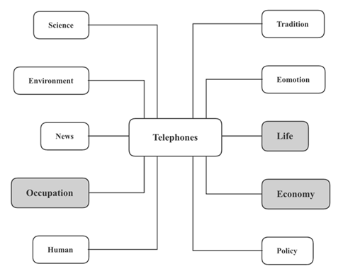

# 社会生活

本部分涉及到的社会生活话题主要有六个部分：
工作变更、社会关系、性别平等、老龄问题、国际旅游

# 工作变更

这个部分涉及到的话题有换工作的原因和换工作的负面影响。可以从TELEPHONES中的Occupation, Economy, Human, Life, Emotion, Technology这六个部分展开

## 换工作的原因

### 经济商业

1. 社会**经济复苏**(economic revival)**使人们更少思考工作稳定性的问题**(could lead people to think less of job security)
2. **新兴产业**(emerging industries)**增加了更多就业岗位**(could provide more jobs)
3. **就业市场**(job market)**回暖**(could be picking up)
4. **获得更高的职位**(could get a higher position)
5. **获得更高的薪资来养家**(could get a pay rise to raise family)
6. **保障家庭衣食无忧** (could better ensure that family is well-clothed and well-fed)

7. **高薪工作**(a well-paid job)**为员工提供了除了基本的食宿之外的购买力**(could provide employees with a stronger purchase power other than basic needs of food and accommodation)

### 科学技术

1. **科学技术发展**(technological advancement)**淘汰了许多低技术的岗位**(have eliminated unskilled positions)

2. 在工厂里，人们**不再需要做重复性或重体力的工作**(will be no longer required to engage in repetitive or physically demanding work)

### 生命生活

1. **需要灵活的工作**(demand job flexibility )
2. **兼顾家庭生活和工作**(need to juggle one’s work and family life)
3. **照顾家庭成员**(will have to cater for family members)
4. **因为身体原因而离职**(may leave for health-related issues)

5. **通勤时间**(travel time)**太长**(be too long)

### 人类人才

1. **学习不同领域的知识技能**(acquire knowledge and skills in different fields)
2. **达成特定的职业目标**(achieve specific career goals)
3. 通过**换工作**(job switching)来**理清楚职业道路**(could help figure out one’s career path)
4. **拓宽专业人脉**(could expand one’s professional networking)
5. **有更多自由去尝试不同的道路**(have more freedom to try out career possibilities)
6. **培养灵活的世界观**(develop a flexible outlook on the world)
7. **培养多种技能**(develop multiple skill sets)

8. **最好的利用形势发展**(strive for making the best of the situation)

### 工作效率

1. **遇到职业瓶颈**(have met a career bottleneck)
2. **想要更换职业道路**(intend to change career paths)
3. **做好准备去探索新的职业轨迹**(have prepared themselves well enough for a new trajectory on career path)
4. **想要在不一样的产业中工作**(want to engage in a different industry)
5. **想回学校深造**(plan to go back to school for further education)
6. **有更好的机会**(have found a better employment)
7. **以前的是季节性或暂时性的**(used to be seasonal or temporary)，**需要全职工作**(may need a full-time job)
8. **公司要求加班**(may be required to work overtime)
9. 在所从事的行业（高科技领域）中，人员**流动性本就很高**(a high turnover)
10. **公司重组**(be reconstructed)，我所在的部门**被裁了**(be eliminated)
11. 公司**裁员**(downsize)，**不够资历**(lack of qualification)，所以合同终止了(**be terminated**)
12. 公司**停业或****破产**(go out of business)
13. **劳动力**(labour force)的**合理配置**(more reasonable distribution)

14. 公司可以通过**猎头招聘**(headhunting)到**更加有工作经验的人才**(recruit more experienced workers)

### 情感特质

1. **与前同事、上司或下属关系不够融洽**(unpleasant relationships with former colleagues, superiors or subordinates)
2. **在情感和行为上，没有与工作和公司相连接**(may be not emotionally or behaviorally connected to the job and the company)
3. **需要走出舒适圈**(need to step out of one’s comfort zone)
4. **寻求新的挑战**(look out for a new challenge)
5. **重塑工作动力**(renew motivation towards working)
6. **价值观**(values)**与公司使命不一致**(no longer align with organizational goals)
7. **个性与公司文化不一**(do not match corporate culture)
8. 在当前位置上，**感觉被轻视**(feel undervalued in the current position)
9. **追求喜欢的职业**(go after the true passion)
10. **更高的幸福感**(a better sense of well-being)

## 换工作的负面影响

### 人类人才

1. **抹黑自己的简历**(tarnish one’s resume)，因为公司**想找到更稳定的员工**(will prefer to employ someone more stable)
2. **被认为缺乏忠诚度**(be considered to be lack of loyalty)
3. **不能积累充足的知识**(could be unable to accumulate sufficient knowledge)
4. **不太可能获得成功，因为无法专精于一个特定的领域**(be less likely to achieve a high level of success due to the inability to specialize in one specific area)
5. **需要再三证明自己**(will have to prove oneself repeatedly)
6. **人口流动性增加**(increased population mobility)，**公共治安管理风险更大**(higher risks in public security)
7. **年轻人**(the influx of young people)**涌入城市地区**(flock into the city)

**导致城市人口的无限增长**(lead to indefinite growth in urban population)

### 经济商业

1. 新工作的**试用期**内(probationary period)**遭受不稳定和财务风险**(suffer from instability and financial risks)
2. **影响养老金**(could affect pension benefits)

3. **招聘和培训新员工的费用增加** (may increase the cost of recruitment and training new staff)

### 情感特质

1. **吸收大量新信息的充满压力的体验**(could be a stressful experience to absorb a large amount of new information)
2. **在职业转变中没有安全感**(could feel insecure amid professional transition)
3. **雇主和雇员之间的信任度降低**may lead to weaker trust bonds between employers and employees)

4. **变得过于苛刻，并且对问题的容忍度降低**(may become over-critical and less tolerant of issues)

### 工作效率

1.**人员变更**(changes in personnel)**会影响业务和生产**may affect businesses and production)

# 社会关系

对于这个子话题，语料可以分为四类：相互依赖的原因、关系疏远的原因、潜在问题和解决方法

可以从Life, Science, Economy, News这几个角度来构思

## 相互依赖的原因

### 工作效率

1. **社会分工细化**(labor division in the society)**加大了各个部门之间的合作**(will lead to increased cooperation among various sectors)

2. **需要团队合作与同行合作**(may require team work and collaboration with people of the same trade )

### 经济商业

1. **服务产业的快速发展**(the rapid growth of the service sector)
2. 更多人开始**习惯他人提供的有偿帮助或服务**(have become accustomed to the paid assistance or services)

3. **社会结构更加牢靠**(stronger social fabric)

### 生命生活

1. **紧张的现代生活和工作**(stressful modern life and work)家庭成员**比之前帮助彼此更多**(help each other more than before)
2. **更多人住在生活成本高的多的大城**(migrate to large cities where the living costs are much higher)
3. **城市污染和拥挤问题**(pollution and over-crowdedness)**使人们压力更大**(may cause people to be more stressed) 
4. **父母都出去工作满足家庭开销**(work to cover family expenditures)，**依赖老人或保姆照顾孩子**(rely on grandparents or babysitters to take care of children)

5. 有一个可以求助的，并且**善解人意的家庭**(have an understanding family to rely on)

## 关系疏远的原因

### 生命生活

1. **追求更多自由和隐私**(pursue more freedom and personal privacy)
2. 减少因**不同生活习惯**(different living habits)和**代沟**(generation gaps)导致的**不必要冲突**(unnecessary conflicts)
3. 更**享受一个人的时光**(enjoy their time alone)，所以会更有动力去学习如何**独立解决问题**(solve problems independently)
4. **商品房的房屋结构**(the structure of commercial housing)**更注重私人空间的营造，减少了和邻居寒暄的机会**(focus on creating private spaces and reduce pleasantries between neighbors)
5. 年轻人更加**经济独立**(be economically independent)，因为上学期间兼职打工，**更少依赖父母的零花钱**(rely less on parents for pocket money)
6. **缩小了的家庭规模**(a reduction in family size)
7. **有财力选择独居**(can financially afford a house to live alone)
8. **犯罪问题**(crimes)**加大了人们对陌生人的戒心**(have increased people’s wariness of strangers)

10. **轻罪频发**(high frequency of petty crimes)

### 工作效率

1. **工作压力大**(stressed out at work)，**没有多余的时间和精力去出门社交**(have no extra time or energy to go out and socialize)
2. **更多出远门读书和工作的机会**(more opportunities to study or work away from home)，**更早锻炼了独立生活的技能**(develop independent living skills at a younger age)

3. **激烈的工作竞争环境**(a highly competitive workplace)**能让员工尽快学会独立处理问题**(could accelerate the process of employees learning to solve problems independently)

### 情感特质

1. 人们的**独立性**(independence)增加，**觉得没有必要扩大身边的社交圈**(do not feel the need to expand their social circle)

### 政府政策

1. **计划生育**(birth control)**变得更容易实施**(have become more readily available)

### 科学技术

1. **信息社会**(information age)**使人们可以很容易通过求助网络来独立完成许多任务**(enable people to perform tasks individually on the internet with more ease)
2. **人们过分依赖科技**(over dependence on the technology)，而**彼此隔绝**(may isolate themselves from each other)
3. **足不出户(**without leaving home)就有**更多的休闲活动选择**(more options of recreation)
4. **公众对线上社交网络的热情**(public zeal for online social networking)
5. **医疗发展**(medical development)使**老人寿命更长、更健康**(lead to longer life expectancy among seniors)，这**意味着他们对子女后代的依赖更少**(become less dependent on their offspring)

6. 可以**在家里以电子方式进行社交，而不是面对面**(socialize electronically from home rather than face to face)

## 潜在问题

### 情感特质

1. **家人亲戚之间的互动减少**(reduced interaction between family members and relatives)**意味着出现问题或者紧急情况时缺乏帮手**(could be lack of assistance when problems or emergencies arise)
2. 单身人士**孤独感增加，幸福感下降**(have an increased level of loneliness and decreased level of happiness)

3. **缺乏社会支持**(lack of social support)可能**会导致更多的精神健康问题**(lead to more mental health problems)

### 经济商业

1. 独生子女**赡养父母的压力大**(higher pressure on the only child to support their aging parents)
2. **老龄化问题**(aging problems)**使得政府投入资金更多到养老之中**(lead governments to pour more funds into pensions)
3. 更多单身男女选择独居，就会有**更多的房屋需求**(a growing demand for residence)
4. **城镇住房紧张问题**(may create a housing crunch in residential towns)

5. **使未来经济增长的可持续性变得不那么确定**(may make the sustainability of the future economic growth less certain )

### 文化传统

1. **传统文化和习俗的传承受阻** (may hamper the inheritance of traditional culture and customs)

2. **无法融入当地社区**(fail to integrate into the local community)

## 解决办法

### 生命生活

1. 个人**学会放下手机、离开电脑****，****多和家人朋友见面**(make attempts to put down the phone, get off the computer and interact more often with family and friends)
2. **提高****家庭的凝聚力**(promote greater family cohesion )
3. **建立社区中心，为当地人举办活动**(set up the community centers and organize activities for the locals)
4. **社区间更多的互动**(encourage more interaction between communities)
5. **敦亲睦邻**(maintain close family bonds)

6. **扩大朋友圈**(expand friend circle)，**花时间外出和社交**(going out and socializing)，**为年轻人的生活注入了重要的活力**(may bring the young generation dynamism)

### 新闻媒体

1. 媒体通过公益广告等方式**宣传良好的邻里和家人关系的重要性**(promote the importance of good neighborhood and family relations)
2. 媒体在**播报社会问题**时(report social issues)，**也要对问题解决的办法或进程进行播报**(should also offer factual information and suggestions)
3. **社区创建线上平台或聊天群供住户彼此熟悉和交流**(should create online platforms or chat groups for residents to communicate with each other)
4. **重拾尊重他人的理念和更好的社区精神**(re-emphasize the respect to others and the spirt of community)
5. 以社区中心的形式**为人们提供相聚的机会**(provide a place where people can meet and socialize)

6. **鼓励将虚拟的社交变成现实生活中的互动**(place importance on real-life interactions over digital ones)

# 性别平等

这个部分的语料分为三个部分：传统印象中的性别差异、分工差异的原因、以及性别平等的原因

## 传统印象中的性别差异

### Emotion

1. 男性在传统印象中具有以下特点：

1.1    有主见(could be assertive)

1.2    具有探险精神(could be adventurous)

1.3    情感上更加坚强(could be more emotionally stronger)

1.4    发奋图强以及雄心勃勃(could be more driven and ambitious)

1.5    体格健壮(could be more physically stronger)

2. 女性在传统印象中具有以下特点：

2.1    愿意服从(could be more submissive)

2.2    追求稳定(seek stability)

2.3    比较容易焦虑(could be more prone to anxiety)

2.4    更加有同理心(could be more empathetic)

### Occupation

1. 男性**赚钱养家**(earn money to support family)，女性**承担家务**(undertake household chores)
2. 男性**承担技术性工作**(take up technical jobs)，女性多**从事文职**(be engaged in clerical jobs)
3. **劳动力市场**(labor market)的**性别分工**(gender division)
4. 在**全球化公司**(global companies)中承担**高级职务**(senior positions)的女性人数更少
5. 男性**有更好的工作前景和发展**(may have better employment prospects and more promotion opportunities)

6. 女性**适合需要良好的人际交往能力、解决问题和解决冲突的工作**(be suitable for jobs demanding good interpersonal skills, problem-solving skills as well as the ability to resolve conflicts)

### 经济商业

男女薪酬差距 income gap between two genders

### 生命生活

**怀孕歧视**(discrimination against pregnancy)

## 分工差异的原因

### Emotions

1. **生理特征不同的产物**(a result of biological traits)

2. **两性心理和喜好上的不同**(psychological differences and preferences for hobbies and interests )

### 工作效率

1. 一些工作**更适合某个性别**(could be gender-specific)
2. 男性领导**更加直接**(tend to be more straightforward)，女性领导**更加有支持性**(tend to be more supportive)
3. **农耕社会和工业社会**(production and work in agrarian and industrial societies)**对体力要求较高(could be more physically demanding)**
4. 护理行业**(caring professions)**更加注重敏感性和同情心(focus more on sensitivity and sympathy)

### 传统文化

1. **传统社会环境**(traditional social context)的**塑造**(shaping)
2. **因循守旧**(may conform to a stereotype)

3. **公认的社会规范**(the accepted social norm)

### 媒体新闻

1. **媒体**(social media)**把男人和女人描述成根本上“不同”的人**(may have portrayed men and women as fundamentally different )

## 性别平等的原因

### 人类人才

1. **人权平等**(equality in human rights)
2. **公司能够招聘到更合适的人才**(may be able to recruit more suitable talents)
3. **女性受教育程度增加**(increased level in women’s education)
4. **女性工作者越来越多**(growing female workforce)
5. **两性平等的概念**(concept of gender equality)
6. **摒弃陈规陋习**(may have discarded old-fashioned stereotypes)
7. **不受传统性别观念的束缚**(be not restricted to the traditional assumptions of gender )

8. **妇女独立的转变**(have become more independent than ever before)

### 科学技术

1. **技术领域的发展**(development in technological sectors)**降低了一部分工作身体条件方面的门槛**(may have lowered the threshold in terms of physical requirements for some jobs)

### 经济商业

1. **劳动力短缺**(shortage of labor force)**需要更多的女性在职场中充分参加工作**(make it necessary for women to participate fully in the workforce)

2. **缩小两性就业差距**(narrow the gender gap between two genders)，**促进经济发展**(promote economic development)

### 生命生活

1. **角色转换**(switch roles)
2. **减少家庭冲突**(reduce domestic conflicts)
3. **一个正常运作的家庭**(a functioning family)
4. **以减轻配偶的家务负担**(lighten the burden of domestic chores for their partners)
5. **为家庭的利益作出承诺**(make commitment in the best interest of the family)
6. **接替照顾孩子的主要职责**(shoulder the main responsibilities of rearing children)
7. **防止基于性别的暴力，特别是针对妇女和女孩的**(prevent gender-based violence, particularly for women and girls)
8. **对男女在家庭中的作用的期望发生变化**(a shift in the expectations of the role men and women play in the family)

9. **使社会更安全、更健康**(make societies grow in a safer and healthier manner)

### 工作效率

1. **社会劳动力需求**(the needs for social workforce)
2. **促进合作**(promote cooperation)
3. **男女性格差异**(gender differences)只适用于一些工作
4. **使工作场所成为一个平衡的环境**(create a gender-balanced environment)

5. **以提供更有利的工作空间**(make for a more positive working environment)

# 老龄问题

这个部分可以从四个角度来准备语料：

老年人的角色、人口老龄化的原因、老龄化带来的问题、老龄化的应对方法

可以从Economy、Occupation、Life、Tradition、Science、Human这几个角度来构思理由

### 经济商业

1. **通过税收、储蓄和消费**(through taxation, saving and spending)，**成为重要的经济贡献者**(be the significant contributors to economy)

2. **做慈善捐款**(make charitable donations)

### 工作效率

1. **许多家庭、社区和组织**(many families, communities and organizations) **都依赖老年人的技能、知识和经验**(all rely on the skills, knowledge and experience of the elders)
2. **在各个领域做义工**(volunteer in various fields )
3. **为社会带来智慧和经验**(may bring wisdom and experience to their communities)
4. **在正式退休年龄之后**(beyond official retirement ages)，**从事教学或研究工作**(carry out teaching and research)

5. **被认为是无益的或反青年的不像年轻人那样有活力、有创造力、有魄力**(be perceived as unhelpful or anti-youth, and not as energetic, creative and enterprising as young people)

### 生命生活

1. **他们在家庭内外提供照顾和支持**(provide care and support inside and outside the home setting)，**如照顾孙子女、做家务、采购杂货、为他人跑腿等**(caring for grandchildren, doing housework, grocery shopping, and running errands for others)

### 传统文化

1. 她们**在信息时代之前被认为是智者**(used to be considered wise before the information age)，是**活的知识库**(a living repository of knowledge)
2. **更加注重传统保护**(focus more on traditional preservation)
3. **把过去的经验告诉我们**(could lend us their experience of a bygone world)
4. **起到有力的提醒作用**(could serve as a powerful reminder)

5. **历史和文化传统的资料库**(a repository of history and traditions in a culture)

## 人口老龄化的原因

### 科学技术

1. **医疗卫生水平提高，提高疾病的治愈率**(the improvement of medical and health care as well as the increased cure rate of diseases)

2. **出生率下降，年轻人口比例下降。避孕手段的发展和医疗技术的发展**(the development of contraceptive methods and medical technology)，**给了人们更多的选择权**(have given people more choices)

### 政府政策

1. **医保政策**(medical insurance policies)**提高疾病治愈率**(have improved the cure rates of diseases)

### 生命生活

1. 人们的**健康意识**(health consciousness)**增强延长寿命**(extend life span)
2. **女性意识提升**(increased awareness of women)，使得越来越多的女性**不愿意生育**(be reluctant to give birth)
3. **婚姻家庭观念的改**变(along with the changes in the concept of marriage and family)，更多人**选择独身主义或丁克家庭**(choose to stay alone or go for a ‘DINK’ family pattern)

### 工作效率

1. 女性**追求事业发**展(seek career advancement)，**不愿意牺牲工作**(be unwilling to sacrifice their jobs)

2. 相对比于过去几十年，现在人们的**工作更加不稳定，安全感缺失**(job instability and lack of job security)

### 经济商业

1. **城市生活压力大**(mounting pressure in urban cities)，人们**不愿意生小孩**(be reluctant to raise a kid)
2. **养育成本增加**(higher cost of childrearing)

3. **城市房价上涨**(rising housing prices in cities) 

### 人类人才

1. **高等教育的成功普及**(wider spread of higher education)**导致生育率下降**(lead to lower fertility rates)，人们**更容易晚婚晚育**(be more likely to marry later and have children later)

## 老龄化带来的问题

### 工作效率

1. 劳动力缺乏labor shortage，许多行业发展受影响 may have affected many industries

### 生命生活

1. 对于年轻人而言，**照顾老人的压力大**(high pressure for taking care of the old)

2. 年轻人可能**很难理解长辈的陈旧观念和行为**(may find it difficult to relate to the old-fashioned views and behaviors of the seniors)

### 经济商业

1. 更多的钱投入到**养老保障**(be allocated to health care systems)
2. **生产力下降**(the decline of productivity)
3. **更高的人力成本**(higher cost of human resources)
4. **国际竞争力**(international competitiveness)**减弱**(may have weakened)
5. 因为人们需要更多的钱**去规划更长的退休岁月**(plan for the years after retirement)，所以他们**倾向于减少消费和多做储蓄**(tend to spend less and save money)，**这对消费驱动的经济是不利的**(be detrimental to a consumption-driven economy)
6. **更大的医疗需求**(greater demand for health care)**可能会消耗一个国家的医疗系统**(can be a drain on a country’s healthcare system)
7. **影响国家未来的繁荣**(affect the future prosperity of a country)

8. **养老金成本的提高**(higher pension costs)意味着**国家财政负担的进一步加重**(a further financial burden for the state)

## 老龄化的解决方法

### 经济商业

1. **鼓励私人养老金**(encourage private pension)

2. **应鼓励公民自己处理自己的财政问题**(ought to be incentivized to handle their own finances)

### 生命生活

1. **提供更完备的公共设施**(provide more complete public facilities)**可以起到改善作用**(can make a difference)
2. **社区开展活动**(organize more community activities)，**教会老人使用电子产品**(teach the elderly population how to use electronic devices)
3. **开发并推广老年人也能方便使用的电子产品**(develop and promote elderly-friendly technological products)

4. **医院或护理院**(hospitals and nursing homes)**可以提供高水平的专业服务**(can step in with a high level of professional care)

### 工作效率

1. **为长者提供更多分工或兼职的第三产业工作**(provide more part-time and part-time tertiary sector jobs for the elders)
2. **提高退休年龄**(raise the retirement age)，**以增加税收和消费支出，并增加劳动力供应**(increase tax and consumer spending as well as the supply of labor)
3. 企业**转变观念，认可老年人的经验和价值**(need to raise the awareness of the value and wisdom of senior workers in the work places)

### 人类人才

1. **提高生育率**(boost fertility rates)

2. **通过福利政策降低养儿成本**(lower the cost of raising children through welfare policies)，例如“**儿童津贴**”(children benefit)

### Tradition

1. **鼓励长者成为文化传承者**(encourage elders to become cultural bearers)，例如**邀请长者撰写个人历史，或在学校介绍他们的人生经历等**(invite elders to write their personal histories and present their life experiences at school)

# 国际旅游

这个话题可以从国际旅游普及的原因、国际旅游的积极影响和国际旅游的消极影响这三个方面来构思

## 国际旅游普及的原因

### 经济商业

1. **个人可支配收入增加**(an increase in disposable income per capita)
2. **经济全球化**(economic globalization)
3. **航空票价降低**(lower airfares)
4. Airbnb和其他**家庭共享平台**(home-sharing platfroms)

5. **文商交融的趋势渐长**(the gradual upturn in cultural and commercial intermingling)

### 政府政策

1. 旅行签证travel visa门槛放低have a lower threshold

### 科学技术

1. **跨国交通**(cross-border transportation)**更省时更安全**(could be more time-saving and safer)

2. 网络**使得行程安排更便捷**(allow people to make itineraries more conveniently)

### 新闻媒体

1. 媒体广告的宣传刺激 be simulated by advertising
2. **更多旅行研究和预订的在线资源**(more online resources for travel research and bookings)

### 情感特质

1. **千禧一代(**millennial generation)**出国旅行意愿强**(have high willingness to travel abroad)

2. **目的地濒临灭绝的意识**(the awareness of the imminent extinction of some destination) **促使一些人趁早前往**(motivate some people to visit before it is too late)

## 国际旅游的积极影响

### 人类人才

1. **走出舒适区**(get out of one’s comfort zone)，**在异国环境中寻找方向**(navigate the foreign environment)
2. **培养在国外环境中的自信和适应能力**(build confidence and the ability to adapt on foreign environments)

3. **摆脱喧嚣**(break away from the hustle and bustle)，**改变自己的心态**(change one’s mindset)

### 经济商业

1. **促进与国际接轨**(promote international connection)，**带来更多的商业和文化合作**(bring more business and cultural collaborations)
2. **带来金钱和提供就业机会**(bring in money and provide jobs)
3. **为基础设施投资和保护环境或文化提供经济激励**(provide economic incentives for investment in infrastructure and preserve the environment as well as the culture)
4. **为东道国的经济带来资金注入**(bring capital into the host country’s economy )
5. **政府部门收取外国人的签证费**(receive visa fees from foreigners)
6. 酒店老板和旅行和导游**从游客那里获得固定收入**(get regular income from visitors)
7. **形成对劳动力的需求**(create a need for labor)

8. **造福家乡人民**(benefit the population in the hometown)

### 传统文化

1. **沉浸于另一种语言**(be immersed in another language)
2. **培养文化敏感性**(develop cultural sensitivity)，**了解文化价值和规范**(be aware of cultural values and norms)
3. **给国家一个展示自己的机会**(an opportunity for a nation to present itself to the world)，**提高国家在世界的形象**(raise its profile in the world)
4. **消除敌意和偏见**(eliminate hostility and prejudice)
5. **文化和美食**(cultures and cuisines)**已被全球所熟悉和流行**(have been made known and popular worldwide)
6. 让人能**以全新角度理解自己的文化**(give natives a new perspective on their own homogenous culture)
7. **建立更稳定的国际社会**(create a more stable world community)
8. **促进其他语言的学习**(promote the learning of other language)
9. **举办文化节和盛会**(organize cultural festivals and galas)

10. **颂扬该地的独特之处**(to celebrate a unique aspect of the place)

## 国际旅游的消极影响

### 生命生活

1. **饮食问题**(have dietary issues)，如**饮食限制和食物过敏**(dietary restrictions and food allergies)

### 环境保护

1. 由于**游客数量庞大**(the large volume of geographic mobility in tourism )，**加剧了对环境的影响**(exacerbate the already negative impact on the environment)
2. **陆路和海路旅行**(land and sea travel)都**涉及到化石燃料的消耗和随之而来的碳排放**(involve the consumption of fossil fuels and consequent carbon emissions)
3. **破坏这些环境的原始状态**(could damage the pristine nature of these environments)

4. **酒店、供暖、饮食和交通**(hotels, heating, catering and transportation)**都会对周边环境产生影响**(have an impact on the immediate surroundings)

### 工作效率

1. **旅游业的工作**(jobs in the tourism)通常是**季节性的、不稳定的**(be usually seasonal and insecure)，而且是**相对低工资和低技能的**(be relatively low-paid and low-skilled)

2. **商品和货币交换的本质**(nature of the exchange of goods and money)**会涉及到被剥削的工人**(may involve the exploitation of workers )

### 传统文化

1. **文化的商业化**(cultural commercialization)**破坏了旅游目的地的灵魂**(do damages to the core values of a touristy destination)
2. **文化冲突**(culture shock)
3. **语言障碍**(language barriers)
4. **对本土文化构成潜在威胁**(pose a potential threat to the indigenous culture)
5. **破坏文物**(destruct cultural relics)
6. **文化同化及文化渗透**(cultural assimilation and penetration)
7. **度假者**(holidaymakers)**对其他文化的不尊重**(may behave disrespectfully to other cultures)
8. **有冒犯到当地文化的风险**(may risk offending the host culture )

9. **滋生对某些民族文化的憎恶**(breed resentment towards some culture)

### 经济商业

1. **交通和住宿费用过高**(excessive costs in transportation and accommodation)

2. **本来有效用于其他方面的资金现在被花在了旅游方面**(direct money to tourism which could have been used more effectively elsewhere )