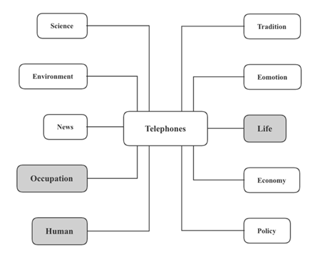

# 科技发展

本部分内容包括两个部分，其一是科技影响，其二是太空探索

# 科技影响

关于科技的影响可以划分成三个部分：

1. 科技的整体影响
2. 远程办公的影响
3. 社交网络的影响

可以从TELEPHONES中选取环境保护environmental，工作效率，生命生活，人类人才，经济商业economy这五个方向来阐述

## 科技的整体影响

### 环境保护

1. **加快能源消耗**（accelerate energy consumption）
2. 科技产品更新换代过快**导致资源耗竭**（lead to exhaustion of resources）以及废物增加
3. **化学制**(chemicals)**剂污染土地和水资源**（contaminate soil and water resources）

4. **环保科技缓解污染**（environment friendly technology alleviates pollution）

### 人类人才

1. **缺乏运动的生活方式**（inactive lifestyle）**导致肥胖**（lead to obesity）
2. **手机上瘾**（addiction to cell phones）导致晚睡
3. **提升医疗水平**（improve medical treatment），如癌症扫描等，可以**及早发现疾病**（detect the disease early），从而**挽救并延长生命**（save and extend lives）

4. **技术的进步是**人类历史**的特点**（be characterized by technological developments）

### 工作效率

1. **提高产量**（boost yield），**解决粮食不足**（solve food shortage）
2. 由于**转基因技术**（genetically modified technology）的发展，**食品种类更加丰富**（more variety in diet）
3. **大幅提高生产力**（greatly increase productivity），**节省人力和时间**（save manpower and time）

4. **带来更多便利**（bring greater comfort into our lives），**简化我们的生活**（simplify our lives）

5. 对**设备的过度依赖**(over-reliance on equipment)导致一旦**故障**（breakdown）反而**影响效率**（affect efficiency）

6. **低技术的工作**（low-skilled jobs）被机器所取代，**导致失业**（result in unemployment）

### 经济商业

1. 技术价格**逐渐降低**(become more affordable)，**网络**（internet access）**更加普及**(seem increasingly ubiquitous)
2. 低收入学校的儿童无法获得信息技术，**可能会妨碍他们学习技术技能**（be hindered from learning the tech skills）

3. 身处偏远地区的学生可以**获得高质量的远程教育**（receive distance education of high quality）

## 远程办公的影响

### 工作效率

1. **没有地域上的限制**（without geographical limitations）
2. **减少高峰时段的车流量**（reduce the volume of traffic during rush hours）
3. 我们可以自由**布置工作空间**（furnish our working space），**导致我们对周围环境的满意度增加**（result in increased satisfaction with our surroundings）
4. **不用穿制服或正式的服装**（do not have to wear a uniform or formal style of clothes）
5. **节省通勤时间和费用**（save commuting time and expenses）
6. **工作和生活界限模糊导致疲劳和压力**（the line between work and personal life has blurred, leading to fatigue and stress）
7. 在家工作会对**与同事的社交关系产生负面影响**（negatively affect social bonds with colleagues）
8. **导致团队沟通效率降低**（lead to low efficiency in team communication）
9. **容易分散注意力**（can easily cause distractions）

10. 持续的干扰可能会**减少高效的工作时间**（result in less productive work time）

### 人类人才

1. **采取久坐的生活方式**（adopt a sedentary lifestyle），导致**生病几率增加**（a higher risk of contracting diseases），尤其是**肥胖症**（obesity）

2. **视力减退**（weakened eyesight）

### 生命生活

1. **导致****公共交通需求降低**（cause lower demand for public transport）
2. **导致过度依赖数据平台和网络**（result in an over-reliance on data platforms and networks）
3. 引起**网络安全**（cyber-attacks），**数据盗窃**（data fraud or theft），**数据错误**（digital misinformation）等问题

4. **家庭生活和工作生活重叠** （overlap home life with work life）

## 社交网络的影响

### 生命生活

1. **联络久违的朋友** (reconnect with long-lost friends)
2. **与世界各地的人即时交**流（communicate instantly with each other all over the world）
3. Facebook等平台的特别兴趣小组使人们**能与有共同兴趣的人联系**（allow individuals to connect with people who share a common interest）
4. **在几秒钟内分享想法和观点**（share thoughts and opinions in a matter of seconds）
5. **缓解孤独**（ease loneliness）
6. **阻碍真正的人际接触和互动**（prevent real human contact and interaction）
7. 过度共享**使隐私面临风险**（put privacy at risk）
8. **成为网络欺凌的受害者**（fall victim to cyberbullying）
9. **强迫自己在大部分业余时间使用社交媒体**（spend the majority of spare time compulsively using social media）
10. **感到与同龄人保持同步的压力，引发不安全感**（feel pressured to keep up with peers, triggering insecurity）
11. **被与日常生活无关的信息轰炸，浪费大量时间并导致生产力下降**（be bombarded with information irrelevant to daily lives, squandering large amount of time and killing productivity）

12. 人们更少参与周围的社区活动，**导致社会变得更加分散**（lead to societies becoming more fragmented and disjointed）

# 太空探索

关于太空探索，主要选择Environment、Technology、Economy、Life、Human、Occupation这六个角度来构思

## 太空探索的好处

### 环境保护

1. 提供额外的**矿产资源**(mineral resources)和**燃料源**(fuel sources)，**缓解对能源枯竭的担忧**（ease the concern about energy depletion）
2. **提供监视地球脆弱环境的技术**(provide technologies to monitor the earth’s fragile environment), 例如**卫星通信**(satellite communications)，GPS, **遥感**（remote sensing）
3. 新的研究成果**有利于解决现有的环境问题**（be conducive to solving existing environmental problems）
4. **了解有关生命形成和进化条件的更多信息**（learn more about the conditions under which life forms and evolves）
5. **太空移民**（space migration）**有助于缓解人口过剩**（help to mitigate overpopulation）

6. **在宜居的星球上维持人类文明** （sustain human civilization on a habitable planet）

### 科学技术

1. **收集研究数据**（collect research data），并**加快科研进步**（speed up scientific progress）
2. **推动相关领域的创新发明**（drive innovations in related fields），如人工智能和**农业**（agriculture）

3. **从其他文明的经验中学习，以解决诸如核战争和全球污染等地球上现有的问题**（learn from the experiences of other civilizations to solve the existing problems on earth, such as nuclear war and global pollution）

### 经济商业

1. **促成太空旅游等新兴产业**(facilitate new industries such as space tourism)

2. 在不久的将来，太空旅游可能会**成为价值数十亿美元的产业**(become a multi-billion-dollar industry)

### 人类人才

1. **满足人们对自然的好奇心**（satisfy people's curiosity about nature）
2. **消除人类在宇宙的孤独感**（eliminate mankind’s loneliness in the universe）
3. **缓解人对地球毁灭的焦虑**（**alleviate** anxiety about the destruction of the earth）
4. **起到启发作用**（serve as an inspiration），准确展示人类通过专业知识和合作可以实现的目标
5. 探索（exploration）一直是人类的特性（have always been a feature of mankind）

6. 探索太空**代表着人类发展的下一步** （represent the next step in our evolution）

### 工作

1. 创造就业 create employment

### 生活生命

1. 现在太空中有卫星**使几乎在地球上的任何地方都能使用电话和接入互联网**（make phone calls and internet access possible nearly everywhere on Earth），还会**为天气预报提供数据**(provide data for weather forecast)

2. **提前发现对地球的威胁**（detect threats to Earth ahead of time）

3. 如果未来发生太空战争，太空技术和基础设施**可用于战争和国防**（can be used for warfare and defense），以保护国家

## 太空探索的坏处

### 经济商业

1. 设备生产和发射**消耗大量政府资金**（involve excessive government expenditure）
2. **大部分国家支付不起**（be unaffordable for most countries），尤其是**发展中国家**（developing countries）

3. **需要长期的投入与资金**（require long-term commitment and funding）

### 工作效率

1. **可能耗时**（can be time-consuming），且**收效甚微**（deliver limited immediate results）

2. **可能没有任何成果**（may not yield any results）

### 环境保护

1. **发射所需的高燃料成本**（require high fuel costs for launch）
2. **留下大量废物**（leave behind a large amount of waste）
3. **造成空气污染和悬浮物污染**（cause air pollution and particle pollution）
4. 辐射和空气污染**引发疾病**（result in diseases）
5. 太空垃圾**可能掉落在地球上**（can fall on Earth）或**对未来的太空旅行者造成破坏**（do damages to future space travelers）

6. 更频繁的太空飞行会**增加碳排放**（increase carbon emissions），从而**对气候产生负面影响**(negatively affect the climate)

### 生命生活

1. 宇航员通常会**患有精神疾病**（suffer from mental problems）
2. 有风险的项目**无法确保宇航员的安全**（cannot ensure the safety of astronauts）
3. 我们的地球**有被接管和被支配的风险**（run the risk of being taken over and dominated）

4. **与宗教价值观冲突**（cause conflict with religious values），这有可能**导致社会混乱**（lead to chaos in society）